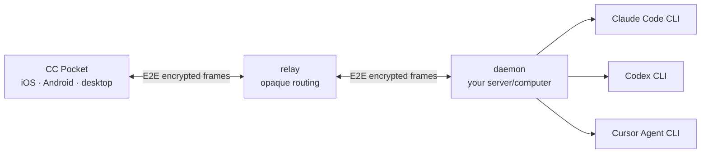

# CC Pocket — Claude, Codex & Cursor on your phone

[](https://github.com/ac54u-mobile/cc-pocket/actions/workflows/ci.yml)
[](LICENSE)

[简体中文](README.md) | **English**

CC Pocket is a self-hosted remote client for driving **Claude Code**, **OpenAI Codex**, and **Cursor Agent** on your own computer or server from iPhone, Android, or the desktop app. It keeps projects, native agent sessions, approvals, model selection, images, streaming output, and changed files in one interface.

This repository is the `ac54u-mobile` edition. It extends the upstream project with Cursor Agent support, live Cursor account model discovery, three-backend session management, a redesigned mobile project/chat experience, and unsigned iOS packages for TrollStore.

## What's new in 1.3.5

- One consistent new-session mode UI for Claude, Codex, and Cursor. Fresh installs start with **Claude + Default**; saved defaults are reused afterward.
- Approval risk/impact details and a chronological audit trail for decisions, tools, and completion.
- Cross-device handoff and reading-position restoration; reopened chats return to where they belong.
- Automatic six-digit pairing, smoother long replies, and keyboard-safe recent messages.
- Codex limit snapshots, the official OpenAI Blossom mark, and a native iOS photo attachment symbol.

See the full [changelog](CHANGELOG.md).

> This is not an official Anthropic, OpenAI, or Cursor product. Cursor usage and model access come from the Cursor account logged in on the daemon host.

## Highlights

- Choose Claude, Codex, or Cursor when creating a session; the selected backend stays bound to it.
- Resume native history from all three agents and group conversations by working directory.
- Discover the models available to the logged-in Cursor account instead of presenting an invented catalog.
- Switch model, reasoning effort/variant, and permission mode from the composer status bar.
- Stream answers, thinking, tool activity, background jobs, approvals, and context usage.
- Review approval risk, affected scope, authorization history, and a chronological activity timeline.
- Send image attachments, use voice dictation, slash commands, and `@file` completion.
- Browse changed files, inspect highlighted diffs, and open a remote terminal.
- Pair multiple computers and move between active sessions from one phone.
- Route only end-to-end encrypted frames through the relay.
- Build an unsigned TrollStore IPA with the included GitHub Actions workflow.

## Architecture



The relay pairs devices and forwards ciphertext. Session plaintext and private keys stay on the app and daemon endpoints. See [the security model](docs/SECURITY.md).

## Agent support

| Capability | Claude Code | OpenAI Codex | Cursor Agent |
|---|---:|---:|---:|
| New and resumed sessions | Yes | Yes | Yes |
| Streaming and interruption | Yes | Yes | Yes |
| Tool/permission handling | Yes | Yes | Agent-dependent |
| Model switching | Yes | Yes | Yes |
| Reasoning effort | Yes | Yes | Via account model variants |
| Images | Yes | Yes | When supported by the selected model |
| Native history discovery | Yes | Yes | Yes |

Cursor model names, availability, quotas, and context windows are controlled by Cursor and the logged-in account. The daemon passes the real model ID to `cursor-agent`; a display label is never used as a CLI model ID.

## Repository modules

| Module | Purpose | Stack |
|---|---|---|
| `:protocol` | Shared encrypted wire protocol and frame types | Kotlin Multiplatform |
| `:daemon` | Runs agents and scans local/native session history | Kotlin/JVM + Ktor |
| `:relay` | Pairing and opaque encrypted-frame routing | Kotlin/JVM + Ktor + SQLite |
| `:mobile:composeApp` | iOS, Android, and desktop clients | Compose Multiplatform |
| `iosApp` | Native iOS host and packaging configuration | Swift/Xcode + Compose framework |

## Requirements

- JDK 17 and an Android SDK for Gradle configuration/builds.
- Xcode on macOS for local iOS builds.
- At least one installed and authenticated agent CLI:
  - `claude`
  - `codex`
  - `cursor-agent` (log into the Cursor account on the daemon host)

Copy the placeholder Firebase files for local builds when real Firebase credentials are not required:

```bash
cp mobile/composeApp/google-services.json.template mobile/composeApp/google-services.json
cp iosApp/iosApp/GoogleService-Info.plist.template iosApp/iosApp/GoogleService-Info.plist
```

## Build and run

```bash
# Compile and test the server components
./gradlew test

# Build the daemon distribution
./gradlew :daemon:installDist

# Run locally, then pair from another terminal
daemon/build/install/cc-pocket-daemon/bin/cc-pocket-daemon run
daemon/build/install/cc-pocket-daemon/bin/cc-pocket-daemon pair

# Android debug build
./gradlew :mobile:composeApp:assembleDebug

# Desktop client
./gradlew :mobile:composeApp:run
```

For a relay deployment and a persistent daemon service, follow [daemon operations](docs/RUN.md) and [relay deployment](deploy/README.md). Supply your own relay URL; this repository does not promise a public hosted relay.

## Cursor Agent setup

1. Install Cursor/Cursor Agent on the daemon host.
2. Sign into the Cursor account on that host and verify `cursor-agent --list-models` works.
3. Start or restart CC Pocket daemon so it can detect the executable and account catalog.
4. Pair the app, create a session, and choose **Cursor**.

Ultra does not mean every model has unlimited quota. First-party and API-backed model pools may reach their limits independently; CC Pocket surfaces the error returned by Cursor.

## iOS and TrollStore

### GitHub Actions

Open **Actions → ios-trollstore → Run workflow**. The workflow builds an unsigned Release archive and uploads a `cc-pocket-…-trollstore.ipa` artifact. It does not require an Apple signing certificate. Install the artifact only on a device/environment that supports TrollStore.

### Xcode

Generate/open `iosApp/iosApp.xcodeproj`, choose your Apple team and a unique bundle identifier, then build to a connected device. See [iOS device installation](docs/ios-device.md).

## CI and release workflows

- `ci.yml` — protocol/daemon/relay tests and mobile desktop-target compilation on pushes and pull requests.
- `ios-trollstore.yml` — unsigned TrollStore IPA artifact.
- `ios-release.yml` — signed iOS release path for configured maintainers.
- `release.yml` — multi-platform release packaging.
- `build-windows.yml` — Windows artifacts.

Secrets, signing identities, Firebase credentials, and deployment hosts are intentionally not committed.

## Documentation

- [User guide](docs/USAGE.md)
- [Daemon operation and testing](docs/RUN.md)
- [Security model](docs/SECURITY.md)
- [iOS device build/install](docs/ios-device.md)
- [Release process](docs/RELEASE.md)
- [Changelog](CHANGELOG.md)
- [Relay deployment](deploy/README.md)

## Upstream and license

This edition is derived from [heypandax/cc-pocket](https://github.com/heypandax/cc-pocket) and keeps the upstream MIT license and attribution. Additional UI ideas were studied from open-source projects including Happy; product marks remain the property of their respective owners.

MIT — see [LICENSE](LICENSE).
