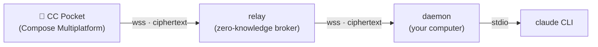

# CC Pocket

**English** | [简体中文](README.zh-CN.md)

Drive the `claude` CLI on your computer from your phone — from anywhere, not just your LAN. Start/resume sessions, browse working directories, send prompts, and approve or deny Claude's tool-permission requests remotely. Traffic flows through a **zero-knowledge relay** that only ever forwards end-to-end-encrypted ciphertext. Clean-room Kotlin, MIT.

**🌐 Website:** <https://heypandax.github.io/cc-pocket/> · **📱 Get the app:** [App Store](https://apps.apple.com/cn/app/cc-pocket-%E9%9A%8F%E8%BA%AB%E7%BC%96%E7%A8%8B%E9%81%A5%E6%8E%A7/id6778773969) (iPhone & iPad) · [Android APK](https://github.com/heypandax/cc-pocket/releases/latest) (GitHub Releases)



The relay pairs phone ↔ computer and routes opaque encrypted frames between them; it holds no message content and no private keys. The phone and the daemon run an end-to-end session (P-256 ECDH + HKDF + AES-256-GCM, an X3DH/Noise-style handshake) so plaintext never leaves the two trusted endpoints.

## What you can do from your pocket

- **Approve from anywhere** — tool-permission requests reach your phone the moment Claude raises one. Allow or deny in seconds; if you don't, it times out to a safe deny.
- **Pick up any session** — resume the exact Claude session you left running on your computer, or start a fresh one in any repo.
- **Watch it think, live** — real-time streaming output, code blocks and tool events, exactly as they render in the terminal.
- **Switch the working directory** — point Claude at any repo on your computer mid-conversation, with recents, a live breadcrumb, and per-project session counts.

## Modules

| Module | What | Stack |
|---|---|---|
| `:protocol` | Shared wire protocol (`pocket/*` frames) — single source of truth | Kotlin Multiplatform + kotlinx.serialization |
| `:daemon` | Runs on your computer; drives `claude` as a subprocess, dials out to the relay | Kotlin/JVM + Ktor |
| `:relay` | Cloud broker: device-key pairing, ciphertext routing, multi-tenant, rate-limited | Kotlin/JVM + Ktor + SQLite |
| `:mobile` | The CC Pocket app | Compose Multiplatform — Android · iOS · desktop |

## Install

Two pieces: the **app** on your phone, and a hosted-relay **daemon** on your computer.

**1. Get the app on your phone** — [App Store](https://apps.apple.com/cn/app/cc-pocket-%E9%9A%8F%E8%BA%AB%E7%BC%96%E7%A8%8B%E9%81%A5%E6%8E%A7/id6778773969) for iPhone & iPad, or the [Android APK](https://github.com/heypandax/cc-pocket/releases/latest) from GitHub Releases. (On a phone, the [website](https://heypandax.github.io/cc-pocket/) links straight to the store; on a computer it shows a QR to scan.)

**2. Install the daemon on your computer** — the relay is hosted for you.

**macOS** (Apple Silicon and Intel — each gets its own signed, notarized build):

```bash
brew install --cask heypandax/tap/cc-pocket
cc-pocket-daemon service-install --apply   # run on login, auto-reconnect
cc-pocket-daemon pair                       # prints a QR + 6-digit code
```

Then pair your phone (open the app, scan the QR or type the 6-digit code) and start driving Claude from it — full walkthrough in [`docs/USAGE.md`](docs/USAGE.md). Upgrade with `brew upgrade --cask cc-pocket`.

**Linux (x86_64)** is one-click too:

```bash
curl -fsSL https://raw.githubusercontent.com/heypandax/cc-pocket/main/scripts/install.sh | bash
cc-pocket-daemon pair                       # prints a QR + 6-digit code
```

The installer pulls a self-contained tarball (bundled JRE — no system Java) from GitHub Releases, drops it under `~/.local`, and registers a `systemd --user` service; re-run it to upgrade. Voice transcription on Linux uses `ffmpeg` instead of macOS's built-in `afconvert`.

**Windows (x86_64)** — download `cc-pocket-daemon-<version>-windows-x86_64.zip` from [Releases](https://github.com/heypandax/cc-pocket/releases/latest), then in PowerShell:

```powershell
Expand-Archive cc-pocket-daemon-*-windows-x86_64.zip -DestinationPath $env:LOCALAPPDATA\Programs\
$ccp = "$env:LOCALAPPDATA\Programs\cc-pocket-daemon\cc-pocket-daemon.exe"
& $ccp pair                                  # prints a QR + 6-digit code
```

The zip is self-contained (bundled JRE — no system Java); re-extract over the old folder to upgrade. To auto-start it as a background service, run `& $ccp service-install` and follow the printed `sc.exe` commands (run them as Administrator). Other architectures (Linux arm64): build from source — see [Quick start](#quick-start).

## How pairing works

No accounts, no login. The daemon generates a static keypair on first run (its `account id` is the public fingerprint). To add a phone:

```bash
cc-pocket pair        # on your computer — prints a QR + a 6-digit code
```

On the phone, **scan the QR** (system camera or the in-app scanner) or **type the 6-digit code**. The phone registers its own device key and pairs end-to-end. Scanning the QR carries the daemon's key out-of-band, so even a malicious relay can't MITM that path.

See [`docs/SECURITY.md`](docs/SECURITY.md) for the full threat model and the trust-without-trusting-us argument (open source, self-hostable, zero content logging).

## Quick start

Requires JDK 17 and an installed, logged-in `claude` CLI.

**Local single-machine (no relay), for development:**

```bash
./gradlew :protocol:check                         # protocol contract test
./gradlew :daemon:run --args="run"                # daemon — local WebSocket on 127.0.0.1:8765
./gradlew :daemon:run --args="test-client"        # drive it against the real claude
#   dirs · ls <wd> · open <wd> [resumeId] · say <text> · cd <wd> · mode <m> · allow · deny · quit
```

**Through the relay (off-LAN), the real product path:**

```bash
./gradlew :daemon:installDist                      # build the launcher
daemon/build/install/cc-pocket-daemon/bin/cc-pocket-daemon \
  run --relay wss://<your-relay> --claude-bin ~/.local/bin/claude
# then, in another terminal:
daemon/build/install/cc-pocket-daemon/bin/cc-pocket-daemon pair
```

Build the app: Android via `./gradlew :mobile:composeApp:assembleDebug`; iOS via `iosApp/iosApp.xcodeproj` (Xcode). See [`docs/ios-device.md`](docs/ios-device.md) for on-device install.

## Docs

- Website / landing page — <https://heypandax.github.io/cc-pocket/>
- User guide (中文使用文档) — [`docs/USAGE.md`](docs/USAGE.md)
- Run / operate the daemon — [`docs/RUN.md`](docs/RUN.md)
- Security model & threat analysis — [`docs/SECURITY.md`](docs/SECURITY.md)
- iOS device build & install — [`docs/ios-device.md`](docs/ios-device.md)
- Relay deployment (Caddy + Cloudflare + systemd) — [`deploy/README.md`](deploy/README.md)
- Requirements — [`docs/REQUIREMENTS.md`](docs/REQUIREMENTS.md)
- Implementation plan — [`docs/cc-connect-cc-connect-sequential-graham.md`](docs/cc-connect-cc-connect-sequential-graham.md)
- UI design (claude.ai/design handoff) — [`docs/design/`](docs/design/)
- Provenance / clean-room statement — [`docs/ANTIPLAGIARISM.md`](docs/ANTIPLAGIARISM.md)

## License

MIT — see [`LICENSE`](LICENSE).
