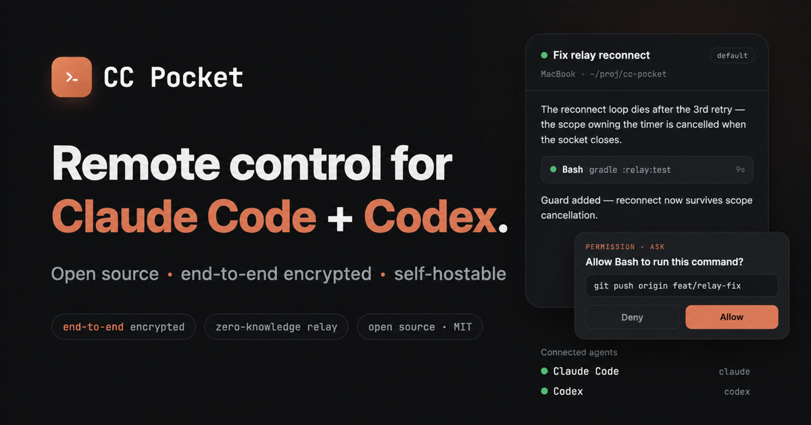
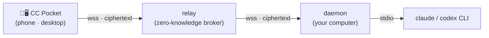

# CC Pocket

[](https://github.com/heypandax/cc-pocket/actions/workflows/ci.yml) [](https://github.com/heypandax/cc-pocket/releases/latest) [](LICENSE)

**English** | [简体中文](README.zh-CN.md)

**Your coding agent, in your pocket.** CC Pocket drives Claude Code — or OpenAI Codex — running on your computer, from your phone or from another computer, from anywhere (not just your LAN). Watch the agent work in real time, answer its tool-permission requests in two taps, and pick up any session exactly where you left it. Traffic flows through a **zero-knowledge relay** that only ever forwards end-to-end-encrypted ciphertext — no account, no content logging. Clean-room Kotlin, MIT.

**🌐 Website:** <https://heypandax.github.io/cc-pocket/> · **📋 Full feature list:** [features](https://heypandax.github.io/cc-pocket/features.html)

<p align="center"><a href="https://heypandax.github.io/cc-pocket/"></a></p>

## Get it

| | Platform | Download |
|---|---|---|
| 📱 **Phone / tablet** | iOS · iPadOS | [App Store](https://apps.apple.com/cn/app/cc-pocket-%E9%9A%8F%E8%BA%AB%E7%BC%96%E7%A8%8B%E9%81%A5%E6%8E%A7/id6778773969) · [TestFlight beta](https://testflight.apple.com/join/8z26MWWr) (new versions first) |
| | Android | [APK](https://github.com/heypandax/cc-pocket/releases/latest/download/cc-pocket-android.apk) from GitHub Releases |
| 🖥️ **Desktop app** | macOS (signed .dmg) | [Apple Silicon](https://github.com/heypandax/cc-pocket/releases/latest/download/cc-pocket-desktop-macos-arm64.dmg) · [Intel](https://github.com/heypandax/cc-pocket/releases/latest/download/cc-pocket-desktop-macos-x86_64.dmg) |
| | Windows | [.msi](https://github.com/heypandax/cc-pocket/releases/latest/download/cc-pocket-desktop-windows-x86_64.msi) (unsigned — SmartScreen → "More info → Run anyway") |
| | Linux | build from source |
| ⚙️ **Daemon** (the computer that runs the agent) | macOS · Linux | `curl -fsSL https://raw.githubusercontent.com/heypandax/cc-pocket/main/scripts/install.sh \| bash` |
| | Windows | `irm https://raw.githubusercontent.com/heypandax/cc-pocket/main/scripts/install.ps1 \| iex` |

On a phone, the [website](https://heypandax.github.io/cc-pocket/) links straight to the store; on a computer it shows a QR to scan. Daemon details, Homebrew/Scoop alternatives and pairing: see [Install](#install).

## How it works



The **daemon** runs on your computer and drives the `claude` or `codex` CLI as a subprocess, dialing *out* to the relay — no inbound ports to open. The **relay** pairs your devices and routes opaque encrypted frames between them; it holds no message content and no private keys. The app and the daemon run an end-to-end session (P-256 ECDH + HKDF + AES-256-GCM, an X3DH/Noise-style handshake), so plaintext never leaves the two trusted endpoints. On the same network, the app connects to the daemon directly for lower latency; the relay stays as the from-anywhere fallback.

## What it does

- **Approve from anywhere** — tool-permission requests reach your phone the moment the agent raises one. Allow or deny in seconds; if you don't, it times out to a safe deny. Four execution modes (ask each step, auto-edit, plan, full auto), a persisted default mode and reasoning effort, plus per-session allow rules you can inspect and revoke.
- **Claude or Codex, per session** — pick the agent when you start a session; streaming, step-by-step approvals and interrupts work the same for both. Codex sessions get a permission preset (Cautious / Balanced / Autonomous / Full auto) mapped to Codex's approval-policy × sandbox, and are tagged teal.
- **Pick up any session** — resume the exact session you left running, or start fresh in any repo. A terminal session is observed read-only; "Continue here" takes it over *in place*, forking only while the terminal is truly still writing. Hand it back later with `claude --resume`. Organize sessions into named groups per project, synced between phone and desktop.
- **Watch it work, live** — streaming output, syntax-highlighted code blocks, tool events with timing, extended thinking, and background tasks. Sub-agents show up as expandable cards, and a multi-agent `Workflow` run gets its own orchestration view with per-phase progress. If your connection blips, the missed output is backfilled on reconnect.
- **See what changed** — browse every file a session touched with line-level diffs, select and copy diff text, preview or export files (approval-gated), tap a path in the transcript to open it, and hover / long-press any path for the full normalized value plus one-tap copy.
- **Talk to it your way** — voice dictation, image / file / video attachments, `@`-file completion, slash-command autocomplete, and quick actions. Switch models mid-session — custom ids routed through third-party gateways (cc-switch and friends) work as-is. Interrupt anytime; prompts sent mid-turn queue cleanly.
- **Desktop mission control** — a native macOS / Linux / Windows app from the same codebase: two panes, ⌘K to jump anywhere, pinned sessions on ⌘1–9, and approvals that surface in a menu-bar/tray popover when the window's behind.
- **Fleet overview** — with several computers paired, one screen shows each machine's online state, running projects and waiting approvals; approve across machines and switch between them instantly.
- **Usage insights** — tokens and estimated cost per model, today's hourly activity bars, and a 30-day heatmap.
- **Share a folder** — grant someone an agent on one folder of your machine: three access levels, an expiry, and one-tap revoke. Shell commands still run as your user — the boundary is honest, not a sandbox.
- **It finds you** — push notification when a turn finishes, heartbeat-guarded reconnect that survives network switches, multi-device pairing, works from cellular or hotel Wi-Fi.
- **Private by design** — end-to-end encryption over a zero-knowledge relay, no accounts, optional Face ID / biometric app lock, open source and self-hostable.

**[Full feature list →](https://heypandax.github.io/cc-pocket/features.html)**

### Works with third-party gateways

If you route Claude Code through an LLM gateway or API relay (`ANTHROPIC_BASE_URL`), the official Remote Control [is disabled as of v2.1.196](https://code.claude.com/docs/en/remote-control) — it requires talking to `api.anthropic.com` directly. CC Pocket drives the CLI over stdio on your machine, so the endpoint doesn't matter: gateway setups (cc-switch and friends, or a vendor's Anthropic-compatible endpoint) work as-is. The daemon detects a gateway `ANTHROPIC_BASE_URL` and the model picker leads with one-tap presets for common vendor ids (DeepSeek, GLM, Kimi, Qwen, MiniMax) alongside the free-form custom id field. Which model an id actually reaches is decided by your gateway.

## Install

Two pieces: the **app** ([Get it](#get-it) above) and the **daemon** on the computer that runs the agent — the relay is hosted for you.

### macOS (Apple Silicon & Intel — signed, notarized)

```bash
curl -fsSL https://raw.githubusercontent.com/heypandax/cc-pocket/main/scripts/install.sh | bash
cc-pocket-daemon pair                       # prints a QR + 6-digit code
```

Verifies the download against the release's SHA256SUMS, installs under `~/.local` (one dir per version, Claude Code-style), and registers the launchd service — runs on login, auto-reconnects. Prefer Homebrew? `brew install --cask heypandax/tap/cc-pocket` (use the full name; an unrelated cask is also called `cc-pocket`).

### Linux (x86_64 / arm64)

```bash
curl -fsSL https://raw.githubusercontent.com/heypandax/cc-pocket/main/scripts/install.sh | bash
cc-pocket-daemon pair                       # prints a QR + 6-digit code
```

Pulls a self-contained tarball (bundled JRE — no system Java), installs under `~/.local`, registers a `systemd --user` service. Voice transcription uses `ffmpeg` instead of macOS's built-in `afconvert`.

### Windows (x86_64)

Needs the [Claude Code CLI](https://github.com/anthropics/claude-code) installed — the daemon drives it.

```powershell
irm https://raw.githubusercontent.com/heypandax/cc-pocket/main/scripts/install.ps1 | iex
```

One command: installs, registers a logon Scheduled Task, and drops straight into pairing. Prefer [Scoop](https://scoop.sh)? `scoop bucket add heypandax https://github.com/heypandax/scoop-bucket` then `scoop install cc-pocket-daemon`.

### Pair & upgrade

Open the app and **scan the QR** (or type the 6-digit code) that `cc-pocket-daemon pair` printed — you're connected end-to-end. Full walkthrough: [`docs/USAGE.md`](docs/USAGE.md).

Upgrade anytime with `cc-pocket-daemon update` — the daemon also checks daily and notifies your phone (add `--auto-update` to `run` to apply silently). Homebrew: `brew upgrade --cask heypandax/tap/cc-pocket` · Scoop: `scoop update cc-pocket-daemon`. Other architectures: [build from source](#building-from-source).

## Security

No accounts, no login. The daemon generates a static keypair on first run (its account id is the public-key fingerprint); the phone registers its own device key during pairing. Scanning the QR carries the daemon's key out-of-band, so even a malicious relay can't MITM that path. The relay only ever sees ciphertext frames — no message content, no private keys, zero content logging.

Threat model and the trust-without-trusting-us argument (open source, self-hostable): [`docs/SECURITY.md`](docs/SECURITY.md). Please report vulnerabilities privately via [GitHub security advisories](https://github.com/heypandax/cc-pocket/security/advisories/new).

## Building from source

| Module | What | Stack |
|---|---|---|
| `:protocol` | Shared wire protocol (`pocket/*` frames) — single source of truth | Kotlin Multiplatform + kotlinx.serialization |
| `:daemon` | Runs on your computer; drives the agent CLI as a subprocess, dials out to the relay | Kotlin/JVM + Ktor |
| `:relay` | Cloud broker: device-key pairing, ciphertext routing, multi-tenant, rate-limited | Kotlin/JVM + Ktor + SQLite |
| `:mobile` | The CC Pocket app | Compose Multiplatform — Android · iOS · desktop |

Requires **JDK 17** (any distribution — the Gradle toolchain auto-downloads one if yours differs), the **Android SDK** (`ANDROID_HOME` or `local.properties`; the Android modules are configured even for JVM-only tasks), and an installed, logged-in `claude` CLI. To build the mobile app, also copy the committed Firebase placeholder once (a real Firebase project is only needed for push/analytics):

```bash
cp mobile/composeApp/google-services.json.template mobile/composeApp/google-services.json
```

**Local single-machine (no relay), for development:**

```bash
./gradlew :protocol:check                         # protocol contract test
./gradlew :daemon:run --args="run"                # daemon — local WebSocket on 127.0.0.1:8765
./gradlew :daemon:run --args="test-client"        # drive it against the real claude
#   dirs · ls <wd> · open <wd> [resumeId] · say <text> · cd <wd> · mode <m> · allow · deny · quit
```

**Through the relay (off-LAN), the real product path:**

```bash
./gradlew :daemon:installDist                      # build the launcher
daemon/build/install/cc-pocket-daemon/bin/cc-pocket-daemon \
  run --relay wss://<your-relay> --claude-bin ~/.local/bin/claude
# then, in another terminal:
daemon/build/install/cc-pocket-daemon/bin/cc-pocket-daemon pair
```

Build the app: Android via `./gradlew :mobile:composeApp:assembleDebug`; iOS via `iosApp/iosApp.xcodeproj` (Xcode — first copy `iosApp/iosApp/GoogleService-Info.plist.template` to `GoogleService-Info.plist` next to it). See [`docs/ios-device.md`](docs/ios-device.md) for on-device install.

## Docs

- Website / landing page — <https://heypandax.github.io/cc-pocket/>
- Full feature list — <https://heypandax.github.io/cc-pocket/features.html>
- User guide (中文使用文档) — [`docs/USAGE.md`](docs/USAGE.md)
- Run / operate the daemon — [`docs/RUN.md`](docs/RUN.md)
- Security model & threat analysis — [`docs/SECURITY.md`](docs/SECURITY.md)
- iOS device build & install — [`docs/ios-device.md`](docs/ios-device.md)
- Relay deployment (Caddy + Cloudflare + systemd) — [`deploy/README.md`](deploy/README.md)
- UI design (claude.ai/design handoff) — [`docs/design/`](docs/design/)
- Historical planning docs (superseded by the code) — [`docs/archive/`](docs/archive/)
- Provenance / clean-room statement — [`docs/ANTIPLAGIARISM.md`](docs/ANTIPLAGIARISM.md)

## Contributing

Issues and PRs welcome — [`CONTRIBUTING.md`](CONTRIBUTING.md) covers build prerequisites, test entry points, and which scripts are maintainer-only. Please report security issues privately via [GitHub security advisories](https://github.com/heypandax/cc-pocket/security/advisories/new) — see [`docs/SECURITY.md`](docs/SECURITY.md).

## License

MIT — see [`LICENSE`](LICENSE).
