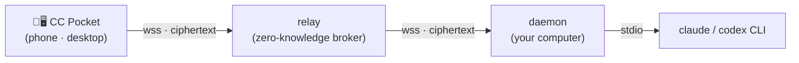

# CC Pocket

[](https://github.com/heypandax/cc-pocket/actions/workflows/ci.yml) [](https://github.com/heypandax/cc-pocket/releases/latest) [](LICENSE)

[English](README.md) | **简体中文**

**你的编程 agent，装进口袋。**CC Pocket 让你用手机——或另一台电脑——操控跑在自己电脑上的 Claude Code 或 OpenAI Codex，走到哪儿管到哪儿，不受局域网限制。实时看它干活，两下点掉工具授权，没聊完的会话随手接起。所有流量都经**零知识中继（zero-knowledge relay）**转发——中继只搬运端到端加密后的密文，无账号，零内容日志。纯净室 Kotlin 实现，MIT 许可。

**🌐 官网：**<https://heypandax.github.io/cc-pocket/> · **📋 完整功能列表：**[features](https://heypandax.github.io/cc-pocket/features.html)

<p align="center"><a href="https://heypandax.github.io/cc-pocket/"></a></p>

## 获取

| | 平台 | 下载 |
|---|---|---|
| 📱 **手机 / 平板** | iOS · iPadOS | [App Store](https://apps.apple.com/cn/app/cc-pocket-%E9%9A%8F%E8%BA%AB%E7%BC%96%E7%A8%8B%E9%81%A5%E6%8E%A7/id6778773969) · [TestFlight Beta](https://testflight.apple.com/join/8z26MWWr)（新版抢先） |
| | Android | [APK](https://github.com/heypandax/cc-pocket/releases/latest/download/cc-pocket-android.apk)（GitHub Releases） |
| 🖥️ **桌面端 App** | macOS（.dmg，已签名） | [Apple 芯片](https://github.com/heypandax/cc-pocket/releases/latest/download/cc-pocket-desktop-macos-arm64.dmg) · [Intel](https://github.com/heypandax/cc-pocket/releases/latest/download/cc-pocket-desktop-macos-x86_64.dmg) |
| | Windows | [.msi](https://github.com/heypandax/cc-pocket/releases/latest/download/cc-pocket-desktop-windows-x86_64.msi)（未签名——SmartScreen 提示点「更多信息 → 仍要运行」） |
| | Linux | 从源码构建 |
| ⚙️ **daemon**（跑 agent 的那台电脑） | macOS · Linux | `curl -fsSL https://raw.githubusercontent.com/heypandax/cc-pocket/main/scripts/install.sh \| bash` |
| | Windows | `irm https://raw.githubusercontent.com/heypandax/cc-pocket/main/scripts/install.ps1 \| iex` |

用手机打开[官网](https://heypandax.github.io/cc-pocket/)会直接跳转商店；用电脑打开则显示二维码供扫码。daemon 的细节、Homebrew / Scoop 替代方案与配对步骤见[安装](#安装)。

## 工作原理



**daemon** 跑在你电脑上，以子进程方式拉起 `claude` 或 `codex` CLI，并**主动外连**中继——不用开放任何入站端口。**中继**只管两件事：帮设备配对、转发加密帧；消息内容它不存，私钥它没有。App 和 daemon 之间是一条端到端加密会话（P-256 ECDH + HKDF + AES-256-GCM，X3DH/Noise 式握手），明文永远只在这两个可信端点上。同一局域网里 App 会直连 daemon，延迟更低；出了门，中继兜底。

## 能做什么

- **随处批准** —— agent 一请求授权，手机马上收到，几秒钟就能批；没顾上，超时自动拒绝、不会放行。四档执行模式（每步都问、只管改文件、先出计划、全自动），默认模式与推理强度设一次就记住，本会话的授权记忆随时可查可撤。
- **Claude 或 Codex，按会话选** —— 开会话时二选一；流式、审批、打断两边手感一样。Codex 会话带一档权限预设（Cautious / Balanced / Autonomous / Full auto），映射到 approval-policy × sandbox，青色标识。
- **接起任何会话** —— 电脑上跑着的会话拿起手机接着聊，想开新的哪个仓库都行。终端里的会话默认只读旁观，「Continue here」**原地**接管——只有终端确实还在写入时才会分叉。聊完 `claude --resume` 交回桌面。会话还能按项目分组，手机和桌面同步。
- **实时看它干活** —— 流式输出、代码高亮、带耗时的工具事件、扩展思考、后台任务，一样不少。子 agent 一人一张卡、点开看报告，多 agent 的 `Workflow` 有自己的进度视图。网络一抖也不怕，重连后漏掉的输出自动补齐。
- **看清改了什么** —— 会话动过的每个文件都摆出来：行级 diff、文字可选可复制、文件能预览能导出（会话外的读取要先过你这关）。对话里的路径点一下就打开，长按还能看完整路径、顺手复制。
- **用你的方式和它说话** —— 语音听写、图片 / 文件 / 视频附件、`@` 文件补全、斜杠命令自动补全、快捷操作。会话中途换模型——cc-switch 之类第三方网关的自定义 id 也照认。随时打断；中途发的消息也不丢，排进下一回合。
- **桌面任务控制台** —— macOS / Linux / Windows 原生 App，与手机同一套代码：两栏布局、⌘K 跳转任意处、⌘1–9 直达固定会话、窗口在后台时授权请求出现在菜单栏 / 托盘弹窗。
- **多机总览（fleet）** —— 配对几台电脑后，谁在线、谁在跑、谁在等审批，一屏看全；隔着机器直接批，切换零等待。
- **用量洞察** —— 按模型统计 token 与预估费用、今日逐小时活动柱状图、30 天热力图。
- **共享一个文件夹** —— 把机器上的一个文件夹借给别人跑 agent：三档访问级别、自带有效期、随时一键撤销。Shell 命令仍以你的用户身份运行——这一点我们写得明明白白，不假装是沙箱。
- **它来找你** —— 回合一结束就推送；心跳保活的重连扛得住换网络；多设备随便配；蜂窝、酒店 Wi-Fi 都能用。
- **为隐私而设计** —— 端到端加密 + 零知识中继、无账号、可选 Face ID / 生物识别应用锁、开源且可自托管。

**[查看完整功能列表 →](https://heypandax.github.io/cc-pocket/features.html)**

### 第三方网关 / API 中转用户完全可用

如果你的 Claude Code 走 LLM 网关或 API 中转（配置了 `ANTHROPIC_BASE_URL`），官方 Remote Control [自 v2.1.196 起会直接禁用](https://code.claude.com/docs/en/remote-control)——它要求直连 `api.anthropic.com`。CC Pocket 在你自己的电脑上通过 stdio 驱动 CLI，端点指向哪里都不影响：cc-switch 之类的网关方案、各家厂商的 Anthropic 兼容端点，原样就能用。daemon 检测到网关 `ANTHROPIC_BASE_URL` 后，模型选择器会优先展示常见供应商的一键预设（DeepSeek、GLM、Kimi、Qwen、MiniMax），自定义 model id 输入框照旧保留。id 实际路由到哪个模型，由你的网关决定。

## 安装

两部分：**App**（见上方[获取](#获取)）和跑 agent 那台电脑上的 **daemon**——中继已经托管好，不用自己搭。

### macOS（Apple Silicon 与 Intel——均已签名、公证）

```bash
curl -fsSL https://raw.githubusercontent.com/heypandax/cc-pocket/main/scripts/install.sh | bash
cc-pocket-daemon pair                       # 打印一个二维码 + 6 位配对码
```

安装器会用 release 的 SHA256SUMS 校验下载、装到 `~/.local`（Claude Code 式的按版本目录），并注册 launchd 服务——开机自启、自动重连。偏好 Homebrew？`brew install --cask heypandax/tap/cc-pocket`（务必用全名——官方仓有个不相干的同名 cask）。

### Linux（x86_64 / arm64）

```bash
curl -fsSL https://raw.githubusercontent.com/heypandax/cc-pocket/main/scripts/install.sh | bash
cc-pocket-daemon pair                       # 打印一个二维码 + 6 位配对码
```

安装脚本会拉取自包含 tarball（内置 JRE——无需系统 Java），装到 `~/.local` 下，并注册 `systemd --user` 服务。语音转写用 `ffmpeg`，而非 macOS 自带的 `afconvert`。

### Windows（x86_64）

需要先装好 [Claude Code CLI](https://github.com/anthropics/claude-code)——daemon 要驱动它。

```powershell
irm https://raw.githubusercontent.com/heypandax/cc-pocket/main/scripts/install.ps1 | iex
```

一条命令：安装、注册登录自启的计划任务，并直接进入配对。偏好 [Scoop](https://scoop.sh)？`scoop bucket add heypandax https://github.com/heypandax/scoop-bucket` 然后 `scoop install cc-pocket-daemon`。

### 配对与升级

打开 App，**扫描** `cc-pocket-daemon pair` 打印的二维码（或输入 6 位配对码）——这就连上了，端到端加密。完整步骤见 [`docs/USAGE.md`](docs/USAGE.md)。

升级随时执行 `cc-pocket-daemon update`——daemon 每天自查新版本并推送手机提醒（`run` 加 `--auto-update` 可静默自动升级）。Homebrew：`brew upgrade --cask heypandax/tap/cc-pocket`；Scoop：`scoop update cc-pocket-daemon`。其他架构：[从源码构建](#从源码构建)。

## 安全

无账号、免登录。daemon 首次运行时生成一对静态密钥（它的 account id 就是公钥指纹），手机配对时注册自己的设备密钥。扫码时 daemon 的公钥直接进手机、不经中继之手（out-of-band），中继就算变坏也插不进来。它从头到尾只见得到密文帧——没有内容，没有私钥，零日志。

完整威胁模型与「信任，但不必信任我们」的论证（开源、可自托管）见 [`docs/SECURITY.md`](docs/SECURITY.md)。安全漏洞请走[私密报告通道](https://github.com/heypandax/cc-pocket/security/advisories/new)。

## 从源码构建

| 模块 | 作用 | 技术栈 |
|---|---|---|
| `:protocol` | 共享的线路协议（`pocket/*` 帧）——唯一事实来源 | Kotlin Multiplatform + kotlinx.serialization |
| `:daemon` | 跑在你电脑上；以子进程方式拉起 agent CLI，主动外连中继 | Kotlin/JVM + Ktor |
| `:relay` | 云端 broker：设备密钥配对、密文路由、多租户、限流 | Kotlin/JVM + Ktor + SQLite |
| `:mobile` | CC Pocket App 本体 | Compose Multiplatform —— Android · iOS · 桌面 |

需要 **JDK 17**（任意发行版——版本不符时 Gradle toolchain 会自动下载）、**Android SDK**（`ANDROID_HOME` 或 `local.properties`；即使只跑 JVM 任务，Android 模块也会在配置期被加载），以及已安装并登录的 `claude` CLI。构建移动端 App 还需先复制一次仓库自带的 Firebase 占位配置（真实 Firebase 项目只有推送 / 统计才需要）：

```bash
cp mobile/composeApp/google-services.json.template mobile/composeApp/google-services.json
```

**本地单机（不走中继），用于开发：**

```bash
./gradlew :protocol:check                         # 协议契约测试
./gradlew :daemon:run --args="run"                # daemon —— 本地 WebSocket 监听 127.0.0.1:8765
./gradlew :daemon:run --args="test-client"        # 用真实 claude 驱动它
#   dirs · ls <wd> · open <wd> [resumeId] · say <text> · cd <wd> · mode <m> · allow · deny · quit
```

**经中继（跨局域网），真正的产品路径：**

```bash
./gradlew :daemon:installDist                      # 构建启动器
daemon/build/install/cc-pocket-daemon/bin/cc-pocket-daemon \
  run --relay wss://<your-relay> --claude-bin ~/.local/bin/claude
# 然后，在另一个终端里：
daemon/build/install/cc-pocket-daemon/bin/cc-pocket-daemon pair
```

构建 App：Android 用 `./gradlew :mobile:composeApp:assembleDebug`；iOS 用 `iosApp/iosApp.xcodeproj`（Xcode——先把 `iosApp/iosApp/GoogleService-Info.plist.template` 复制为同目录的 `GoogleService-Info.plist`）。真机安装见 [`docs/ios-device.md`](docs/ios-device.md)。

## 文档

- 官网 / 落地页 —— <https://heypandax.github.io/cc-pocket/>
- 完整功能列表 —— <https://heypandax.github.io/cc-pocket/features.html>
- 使用文档（中文）—— [`docs/USAGE.md`](docs/USAGE.md)
- 运行 / 运维 daemon —— [`docs/RUN.md`](docs/RUN.md)
- 安全模型与威胁分析 —— [`docs/SECURITY.md`](docs/SECURITY.md)
- iOS 真机构建与安装 —— [`docs/ios-device.md`](docs/ios-device.md)
- 中继部署（Caddy + Cloudflare + systemd）—— [`deploy/README.md`](deploy/README.md)
- UI 设计（claude.ai/design 交付）—— [`docs/design/`](docs/design/)
- 历史立项文档（已被代码演进取代）—— [`docs/archive/`](docs/archive/)
- 来源 / 纯净室声明 —— [`docs/ANTIPLAGIARISM.md`](docs/ANTIPLAGIARISM.md)

## 参与贡献

欢迎 issue 与 PR —— 构建前置、测试入口、哪些脚本仅维护者可用，见 [`CONTRIBUTING.md`](CONTRIBUTING.md)。安全问题请走[私密报告通道](https://github.com/heypandax/cc-pocket/security/advisories/new)，勿发公开 issue —— 详见 [`docs/SECURITY.md`](docs/SECURITY.md)。

## 许可证

MIT —— 见 [`LICENSE`](LICENSE)。
