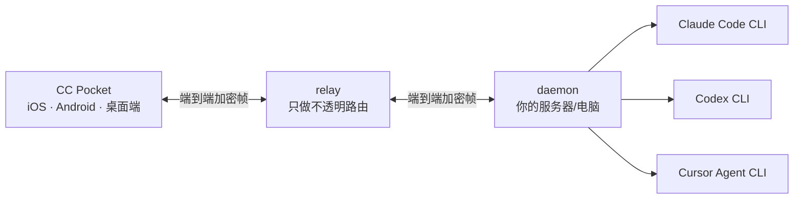

# CC Pocket —— 在手机上使用 Claude、Codex 与 Cursor

[](https://github.com/ac54u-mobile/cc-pocket/actions/workflows/ci.yml)
[](LICENSE)

[English](README.md) | **简体中文**

CC Pocket 是一个可自托管的远程智能编程客户端：在 iPhone、Android 或桌面 App 上，操控你自己电脑/服务器里的 **Claude Code、OpenAI Codex 和 Cursor Agent**。项目目录、原生历史会话、权限审批、模型选择、图片、流式回复和文件改动都集中在同一套界面中。

本仓库是 `ac54u-mobile` 定制版，在上游基础上加入了 Cursor Agent、Cursor 账户模型动态发现、三后端会话管理、重新设计的移动端项目/聊天界面，以及 TrollStore iOS 安装包工作流。

> 本项目不是 Anthropic、OpenAI 或 Cursor 官方产品。Cursor 模型和额度来自 daemon 所在服务器上已登录的 Cursor 账户。

## 主要功能

- 新建会话时选择 Claude、Codex 或 Cursor；会话始终绑定所选后端。
- 恢复三个后端的原生历史，并按工作目录组织项目与对话。
- 从服务器上的 Cursor 账户实时获取可用模型，不展示虚构的模型目录。
- 在输入框上方直接查看和切换模型、思考强度/variant、执行模式与上下文用量。
- 实时显示回复、思考过程、工具调用、后台任务、权限审批和上下文状态。
- 支持图片附件、语音输入、斜杠命令和 `@文件` 补全。
- 查看改动文件与语法高亮 diff，使用远程终端。
- 一部手机配对多台电脑，在活动会话之间快速切换。
- relay 只转发端到端加密帧，不读取对话明文。
- GitHub Actions 一键生成 TrollStore 未签名 IPA。

## 架构



relay 负责设备配对和密文转发；会话明文与私钥只存在于 App 和 daemon 两端。详细说明见[安全模型](docs/SECURITY.md)。

## 三个后端的能力

| 能力 | Claude Code | OpenAI Codex | Cursor Agent |
|---|---:|---:|---:|
| 新建与恢复会话 | 支持 | 支持 | 支持 |
| 流式回复与中断 | 支持 | 支持 | 支持 |
| 工具/权限处理 | 支持 | 支持 | 取决于 Agent 能力 |
| 切换模型 | 支持 | 支持 | 支持 |
| 思考强度 | 支持 | 支持 | 通过账户模型 variant |
| 图片输入 | 支持 | 支持 | 取决于所选模型 |
| 原生历史发现 | 支持 | 支持 | 支持 |

Cursor 的模型名称、开放范围、额度和上下文窗口由 Cursor 与登录账户决定。daemon 始终把真实模型 ID 传给 `cursor-agent`，不会再把界面显示名误当作 `--model` 参数。

## 仓库模块

| 模块 | 作用 | 技术栈 |
|---|---|---|
| `:protocol` | 加密线路协议与共享帧类型 | Kotlin Multiplatform |
| `:daemon` | 启动 Agent、扫描本机原生会话历史 | Kotlin/JVM + Ktor |
| `:relay` | 设备配对与加密帧路由 | Kotlin/JVM + Ktor + SQLite |
| `:mobile:composeApp` | iOS、Android、桌面客户端 | Compose Multiplatform |
| `iosApp` | iOS 原生宿主与打包配置 | Swift/Xcode + Compose framework |

## 环境要求

- JDK 17；Gradle 配置/Android 构建还需要 Android SDK。
- 本地编译 iOS 需要 macOS 和 Xcode。
- daemon 服务器至少安装并登录一个 Agent CLI：`claude`、`codex` 或 `cursor-agent`。

不使用真实 Firebase 时，复制仓库里的占位配置即可编译：

```bash
cp mobile/composeApp/google-services.json.template mobile/composeApp/google-services.json
cp iosApp/iosApp/GoogleService-Info.plist.template iosApp/iosApp/GoogleService-Info.plist
```

## 构建与运行

```bash
# 测试协议、daemon 与 relay
./gradlew test

# 构建 daemon
./gradlew :daemon:installDist

# 本机启动；另开终端生成配对码
daemon/build/install/cc-pocket-daemon/bin/cc-pocket-daemon run
daemon/build/install/cc-pocket-daemon/bin/cc-pocket-daemon pair

# Android 调试包
./gradlew :mobile:composeApp:assembleDebug

# 桌面客户端
./gradlew :mobile:composeApp:run
```

正式使用时请按照 [daemon 运维文档](docs/RUN.md)和 [relay 部署文档](deploy/README.md)配置常驻服务，并填写你自己的 relay 地址。本仓库不承诺提供公共托管 relay。

## Cursor Agent 配置

1. 在 daemon 所在服务器安装 Cursor/Cursor Agent。
2. 在服务器上登录 Cursor 账户，并确认 `cursor-agent --list-models` 能正常执行。
3. 启动或重启 CC Pocket daemon，让它重新发现可执行文件和账户模型目录。
4. 手机完成配对，新建会话时选择 **Cursor**。

Ultra 套餐不代表所有模型都无限使用。第一方模型池、API 模型池和按需消费可能分别达到上限；CC Pocket 会原样显示 Cursor 返回的额度错误。

## iOS 与 TrollStore

### GitHub Actions 编译

进入仓库 **Actions → ios-trollstore → Run workflow**。工作流会构建未签名 Release Archive，并上传 `cc-pocket-…-trollstore.ipa` Artifact，不需要 Apple 签名证书。该 IPA 仅用于支持 TrollStore 的设备/环境。

### Xcode 真机编译

生成或打开 `iosApp/iosApp.xcodeproj`，选择自己的 Apple Team，并设置唯一 Bundle Identifier，然后编译到真机。详细步骤见 [iOS 真机安装](docs/ios-device.md)。

## GitHub 工作流

- `ci.yml`：push/PR 时测试 protocol、daemon、relay，并编译移动端 Desktop target。
- `ios-trollstore.yml`：生成 TrollStore 未签名 IPA。
- `ios-release.yml`：供已配置签名的维护者发布 iOS。
- `release.yml`：多平台发布打包。
- `build-windows.yml`：Windows 安装包。

服务器地址、签名证书、Firebase 凭据和部署密钥不会提交到仓库。

## 文档

- [使用指南](docs/USAGE.md)
- [daemon 运行、测试与运维](docs/RUN.md)
- [安全模型](docs/SECURITY.md)
- [iOS 真机构建与安装](docs/ios-device.md)
- [发布流程](docs/RELEASE.md)
- [relay 部署](deploy/README.md)

## 上游与许可证

本版本基于 [heypandax/cc-pocket](https://github.com/heypandax/cc-pocket) 开发，保留上游 MIT 许可证与署名。部分移动端交互设计参考了 Happy 等开源项目；Claude、Codex、Cursor 等商标归各自权利人所有。

MIT —— 见 [LICENSE](LICENSE)。
