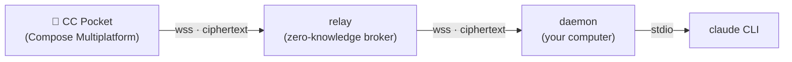

# CC Pocket

[English](README.md) | **简体中文**

在手机上操控你电脑里的 `claude` CLI —— 从任何地方，而不只是同一局域网。新建/恢复会话、浏览工作目录、发送提示词，并远程批准或拒绝 Claude 的工具授权请求。流量经过一个**零知识中继（zero-knowledge relay）**转发，中继只搬运端到端加密后的密文。纯净室 Kotlin 实现，MIT 许可。

**🌐 官网：** <https://heypandax.github.io/cc-pocket/> · **📱 下载 App：** [App Store](https://apps.apple.com/cn/app/cc-pocket-%E9%9A%8F%E8%BA%AB%E7%BC%96%E7%A8%8B%E9%81%A5%E6%8E%A7/id6778773969)（iPhone 与 iPad）· [Android APK](https://github.com/heypandax/cc-pocket/releases/latest)（GitHub Releases）



中继负责把手机与电脑配对，并在两者之间转发不透明的加密帧；它不保存任何消息内容，也不持有私钥。手机与守护进程（daemon）之间运行一条端到端会话（P-256 ECDH + HKDF + AES-256-GCM，X3DH/Noise 式握手），明文永远不离开这两个可信端点。

## 口袋里能做的四件事

- **随处批准** —— Claude 一发起工具授权请求，就立刻推到你手机上。几秒内允许或拒绝；若不处理，超时后自动安全拒绝。
- **接起任何会话** —— 恢复你电脑上正跑着的那个 Claude 会话，或在任意仓库里新开一个。
- **实时看它思考** —— 实时流式输出、代码块与工具事件，和终端里渲染的一模一样。
- **随时切目录** —— 对话中途就能把 Claude 指向电脑上任意仓库，带最近项目、实时面包屑以及每个项目的会话数。

## 模块

| 模块 | 作用 | 技术栈 |
|---|---|---|
| `:protocol` | 共享的线路协议（`pocket/*` 帧）—— 唯一事实来源 | Kotlin Multiplatform + kotlinx.serialization |
| `:daemon` | 跑在你电脑上；以子进程方式驱动 `claude`，主动外连中继 | Kotlin/JVM + Ktor |
| `:relay` | 云端 broker：设备密钥配对、密文路由、多租户、限流 | Kotlin/JVM + Ktor + SQLite |
| `:mobile` | CC Pocket App 本体 | Compose Multiplatform —— Android · iOS · 桌面 |

## 安装

两部分：手机上的 **App**，以及电脑上连接托管中继的 **daemon**。

**1. 在手机上装 App** —— iPhone 与 iPad 走 [App Store](https://apps.apple.com/cn/app/cc-pocket-%E9%9A%8F%E8%BA%AB%E7%BC%96%E7%A8%8B%E9%81%A5%E6%8E%A7/id6778773969)，Android 从 GitHub Releases 下 [Android APK](https://github.com/heypandax/cc-pocket/releases/latest)。（在手机上打开[官网](https://heypandax.github.io/cc-pocket/)会直接跳转商店；在电脑上则显示二维码供扫码。）

**2. 在电脑上装 daemon** —— 中继已为你托管。

**macOS**（Apple Silicon 与 Intel 各有一份签名 + 公证的构建）：

```bash
brew install --cask heypandax/tap/cc-pocket
cc-pocket-daemon service-install --apply   # 开机自启、自动重连
cc-pocket-daemon pair                       # 打印一个二维码 + 6 位配对码
```

然后配对手机（打开 App，扫码或输入 6 位码），就能从手机上操控 Claude 了 —— 完整步骤见 [`docs/USAGE.md`](docs/USAGE.md)。升级用 `brew upgrade --cask cc-pocket`。

**Linux（x86_64）**同样一键：

```bash
curl -fsSL https://raw.githubusercontent.com/heypandax/cc-pocket/main/scripts/install.sh | bash
cc-pocket-daemon pair                       # 打印一个二维码 + 6 位配对码
```

安装脚本会从 GitHub Releases 拉一个自包含 tarball（内置 JRE —— 无需系统 Java），解到 `~/.local` 下，并注册一个 `systemd --user` 服务；重新跑一遍即可升级。Linux 上的语音转写用 `ffmpeg`，而非 macOS 自带的 `afconvert`。

**Windows（x86_64）** —— 从 [Releases](https://github.com/heypandax/cc-pocket/releases/latest) 下载 `cc-pocket-daemon-<version>-windows-x86_64.zip`，在 PowerShell 里：

```powershell
Expand-Archive cc-pocket-daemon-*-windows-x86_64.zip -DestinationPath $env:LOCALAPPDATA\Programs\
$ccp = "$env:LOCALAPPDATA\Programs\cc-pocket-daemon\cc-pocket-daemon.exe"
& $ccp pair                                  # 打印一个二维码 + 6 位配对码
```

这个 zip 是自包含的（内置 JRE —— 无需系统 Java）；覆盖解压到原文件夹即可升级。想让它作为后台服务开机自启，运行 `& $ccp service-install`，再按打印出来的 `sc.exe` 命令执行（需以管理员身份）。其他架构（Linux arm64）：请从源码构建 —— 见 [快速开始](#快速开始)。

## 配对原理

无账号、免登录。daemon 首次运行时生成一对静态密钥（它的 `account id` 就是公钥指纹）。要添加一台手机：

```bash
cc-pocket pair        # 在你电脑上 —— 打印一个二维码 + 6 位配对码
```

在手机上**扫码**（系统相机或 App 内扫描器）或**输入 6 位码**。手机注册它自己的设备密钥并完成端到端配对。扫码会把 daemon 的密钥经带外（out-of-band）传递，因此即便是恶意中继也无法在这条路径上中间人攻击。

完整威胁模型，以及“信任，但不必信任我们”的论证（开源、可自托管、零内容日志），见 [`docs/SECURITY.md`](docs/SECURITY.md)。

## 快速开始

需要 JDK 17，以及一个已安装并登录的 `claude` CLI。

**本地单机（不走中继），用于开发：**

```bash
./gradlew :protocol:check                         # 协议契约测试
./gradlew :daemon:run --args="run"                # daemon —— 本地 WebSocket 监听 127.0.0.1:8765
./gradlew :daemon:run --args="test-client"        # 用真实 claude 驱动它
#   dirs · ls <wd> · open <wd> [resumeId] · say <text> · cd <wd> · mode <m> · allow · deny · quit
```

**经中继（跨局域网），真正的产品路径：**

```bash
./gradlew :daemon:installDist                      # 构建启动器
daemon/build/install/cc-pocket-daemon/bin/cc-pocket-daemon \
  run --relay wss://<your-relay> --claude-bin ~/.local/bin/claude
# 然后，在另一个终端里：
daemon/build/install/cc-pocket-daemon/bin/cc-pocket-daemon pair
```

构建 App：Android 用 `./gradlew :mobile:composeApp:assembleDebug`；iOS 用 `iosApp/iosApp.xcodeproj`（Xcode）。真机安装见 [`docs/ios-device.md`](docs/ios-device.md)。

## 文档

- 官网 / 落地页 —— <https://heypandax.github.io/cc-pocket/>
- 使用文档（中文使用文档）—— [`docs/USAGE.md`](docs/USAGE.md)
- 运行 / 运维 daemon —— [`docs/RUN.md`](docs/RUN.md)
- 安全模型与威胁分析 —— [`docs/SECURITY.md`](docs/SECURITY.md)
- iOS 真机构建与安装 —— [`docs/ios-device.md`](docs/ios-device.md)
- 中继部署（Caddy + Cloudflare + systemd）—— [`deploy/README.md`](deploy/README.md)
- 需求文档 —— [`docs/REQUIREMENTS.md`](docs/REQUIREMENTS.md)
- 实现方案 —— [`docs/cc-connect-cc-connect-sequential-graham.md`](docs/cc-connect-cc-connect-sequential-graham.md)
- UI 设计（claude.ai/design 交付）—— [`docs/design/`](docs/design/)
- 来源 / 纯净室声明 —— [`docs/ANTIPLAGIARISM.md`](docs/ANTIPLAGIARISM.md)

## 许可证

MIT —— 见 [`LICENSE`](LICENSE)。
