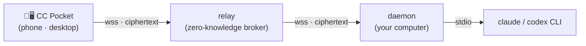

# CC Pocket

[](https://github.com/heypandax/cc-pocket/actions/workflows/ci.yml) [](https://github.com/heypandax/cc-pocket/releases/latest) [](LICENSE)

[English](README.md) | **简体中文**

在手机上操控你电脑里的 Claude Code —— 或者 OpenAI Codex —— 从任何地方，而不只是同一局域网。新建/恢复会话、浏览工作目录、发送提示词，并远程批准或拒绝智能体的工具授权请求。每个会话开始时自己挑后端（Claude 或 Codex）；无论选哪个，流式输出、命令与文件改动的批准、打断都一样好用。流量经过一个**零知识中继（zero-knowledge relay）**转发，中继只搬运端到端加密后的密文。纯净室 Kotlin 实现，MIT 许可。

**🌐 官网：** <https://heypandax.github.io/cc-pocket/> · **📱 下载 App：** [App Store](https://apps.apple.com/cn/app/cc-pocket-%E9%9A%8F%E8%BA%AB%E7%BC%96%E7%A8%8B%E9%81%A5%E6%8E%A7/id6778773969)（iPhone 与 iPad）· [TestFlight Beta](https://testflight.apple.com/join/8z26MWWr)（新版抢先）· [Android APK](https://github.com/heypandax/cc-pocket/releases/latest/download/cc-pocket-android.apk)（GitHub Releases）· **🖥️ 桌面端 App：** macOS（.dmg，已签名）—— [Apple 芯片](https://github.com/heypandax/cc-pocket/releases/latest/download/cc-pocket-desktop-macos-arm64.dmg)· [Intel](https://github.com/heypandax/cc-pocket/releases/latest/download/cc-pocket-desktop-macos-x86_64.dmg)· [Windows（.msi）](https://github.com/heypandax/cc-pocket/releases/latest/download/cc-pocket-desktop-windows-x86_64.msi)

<p align="center"><a href="https://heypandax.github.io/cc-pocket/"></a></p>



中继负责把手机与电脑配对，并在两者之间转发不透明的加密帧；它不保存任何消息内容，也不持有私钥。手机与守护进程（daemon）之间运行一条端到端会话（P-256 ECDH + HKDF + AES-256-GCM，X3DH/Noise 式握手），明文永远不离开这两个可信端点。

## 口袋里能做的事

- **随处批准** —— Claude 一发起工具授权请求，就立刻推到你手机上。几秒内允许或拒绝；若不处理，超时后自动安全拒绝。
- **自定问多问少** —— 四档执行模式（每步询问、自动改文件、先计划、全自动），可持久化的**默认模式**与推理**强度（effort）**，外加本会话授权记忆——会话中途随时切换。
- **接起任何会话** —— 恢复你电脑上正跑着的那个 Claude 会话，或在任意仓库里新开一个；之后在电脑上 `claude --resume` 即可把它交回桌面继续。
- **实时看它思考** —— 实时流式输出、代码块语法高亮、工具事件与后台任务状态，和终端里渲染的一模一样。
- **看清改了什么** —— 浏览会话动过的每一个文件，在手机上逐个查看改动，按语言着色（sql、py、kt、js 等）。
- **接管不分叉** —— 终端里的会话默认只读旁观；「Continue here」原地接续，只有终端的 claude 确实还在写入时才会分支出新会话。
- **树状浏览项目** —— 在电脑的目录里层层下钻（也可切回平铺最近列表），输入即筛选，带实时面包屑与每个项目的会话数。
- **任意模型，含自定义 id** —— 会话中途切换模型；经第三方网关（cc-switch 等）路由的模型 id 直接可用。
- **Claude、Codex 或 Cursor 任选** —— 新建会话时挑后端；除了 OpenAI Codex，也可直接驱动服务器上已登录的 **Cursor Agent CLI**，使用 Cursor Ultra 等账户额度操作当前工作目录。三种后端都支持流式输出、工具事件、模型切换与随时打断；一个会话始终绑定一个后端。

语音听写、图片附件、斜杠命令自动补全、模型切换、任务完成推送等一并齐全。**[查看完整功能列表 →](https://heypandax.github.io/cc-pocket/features.html)**

cc-pocket 现在也以原生**桌面 App**（macOS / Linux / Windows）的形式运行，与手机端同一套 Compose Multiplatform 代码——一个两栏式的「任务控制台」，用同样的远程逐步批准去操控**另一台**电脑上的 Claude Code 或 Codex，从此不再只是手机端。下载：macOS（.dmg，已签名）—— [Apple 芯片](https://github.com/heypandax/cc-pocket/releases/latest/download/cc-pocket-desktop-macos-arm64.dmg)· [Intel](https://github.com/heypandax/cc-pocket/releases/latest/download/cc-pocket-desktop-macos-x86_64.dmg)· [Windows（.msi）](https://github.com/heypandax/cc-pocket/releases/latest/download/cc-pocket-desktop-windows-x86_64.msi)。

## 模块

| 模块 | 作用 | 技术栈 |
|---|---|---|
| `:protocol` | 共享的线路协议（`pocket/*` 帧）—— 唯一事实来源 | Kotlin Multiplatform + kotlinx.serialization |
| `:daemon` | 跑在你电脑上；以子进程方式驱动 `claude`，主动外连中继 | Kotlin/JVM + Ktor |
| `:relay` | 云端 broker：设备密钥配对、密文路由、多租户、限流 | Kotlin/JVM + Ktor + SQLite |
| `:mobile` | CC Pocket App 本体 | Compose Multiplatform —— Android · iOS · 桌面 |

## 安装

两部分：手机上的 **App**，以及电脑上连接托管中继的 **daemon**。

**1. 在手机上装 App** —— iPhone 与 iPad 走 [App Store](https://apps.apple.com/cn/app/cc-pocket-%E9%9A%8F%E8%BA%AB%E7%BC%96%E7%A8%8B%E9%81%A5%E6%8E%A7/id6778773969)，Android 从 GitHub Releases 下 [Android APK](https://github.com/heypandax/cc-pocket/releases/latest/download/cc-pocket-android.apk)。新版本会先上 [TestFlight Beta](https://testflight.apple.com/join/8z26MWWr)，比 App Store 过审上架更早。（在手机上打开[官网](https://heypandax.github.io/cc-pocket/)会直接跳转商店；在电脑上则显示二维码供扫码。）

**或者用桌面端 App** —— cc-pocket 也能在你电脑上跑（用它去操控**另一台**机器）：macOS .dmg（已签名 + 公证）—— [Apple 芯片](https://github.com/heypandax/cc-pocket/releases/latest/download/cc-pocket-desktop-macos-arm64.dmg)· [Intel](https://github.com/heypandax/cc-pocket/releases/latest/download/cc-pocket-desktop-macos-x86_64.dmg)· [Windows .msi](https://github.com/heypandax/cc-pocket/releases/latest/download/cc-pocket-desktop-windows-x86_64.msi)（未签名 —— SmartScreen 提示点「更多信息 → 仍要运行」）。Linux 桌面端：从源码构建。

**2. 在电脑上装 daemon** —— 中继已为你托管。

**macOS**（Apple Silicon 与 Intel 各有一份签名 + 公证的构建）：

```bash
curl -fsSL https://raw.githubusercontent.com/heypandax/cc-pocket/main/scripts/install.sh | bash
cc-pocket-daemon pair                       # 打印一个二维码 + 6 位配对码
```

安装器会用 release 的 SHA256SUMS 校验下载、装到 `~/.local`（Claude Code 式的按版本目录），并注册 launchd 服务——开机自启、自动重连。然后配对手机（打开 App，扫码或输入 6 位码）—— 完整步骤见 [`docs/USAGE.md`](docs/USAGE.md)。升级用 `cc-pocket-daemon update`（daemon 每天自查并推送手机提醒；`run` 加 `--auto-update` 可静默自动升级）。

偏好 Homebrew？`brew install --cask heypandax/tap/cc-pocket` 效果相同（升级用全名 `brew upgrade --cask heypandax/tap/cc-pocket`——官方仓有个不相干的同名 cask）。

**Linux（x86_64 / arm64）**同样一键：

```bash
curl -fsSL https://raw.githubusercontent.com/heypandax/cc-pocket/main/scripts/install.sh | bash
cc-pocket-daemon pair                       # 打印一个二维码 + 6 位配对码
```

安装脚本会从 GitHub Releases 拉一个自包含 tarball（内置 JRE —— 无需系统 Java），解到 `~/.local` 下，并注册一个 `systemd --user` 服务；升级用 `cc-pocket-daemon update`（或重跑一遍）。Linux 上的语音转写用 `ffmpeg`，而非 macOS 自带的 `afconvert`。

**Windows（x86_64）**也是一条命令（需要先装好 [Claude Code CLI](https://github.com/anthropics/claude-code)，守护进程要驱动它）：

```powershell
irm https://raw.githubusercontent.com/heypandax/cc-pocket/main/scripts/install.ps1 | iex
```

它会下载最新的自包含构建、注册登录自启的计划任务（守护进程后台运行、自动连上托管 relay），并直接进入配对 —— 一条命令完成 安装 + 启动 + 配对。升级用 `cc-pocket-daemon update`（或重跑同一条）。

偏好 [Scoop](https://scoop.sh)？效果相同：

```powershell
scoop bucket add heypandax https://github.com/heypandax/scoop-bucket
scoop install cc-pocket-daemon
cc-pocket-daemon pair        # 打印一个二维码 + 6 位配对码
```

升级用 `scoop update cc-pocket-daemon`。其他架构：请从源码构建 —— 见 [快速开始](#快速开始)。

## 配对原理

无账号、免登录。daemon 首次运行时生成一对静态密钥（它的 `account id` 就是公钥指纹）。要添加一台手机：

```bash
cc-pocket-daemon pair # 在你电脑上 —— 打印一个二维码 + 6 位配对码
```

在手机上**扫码**（系统相机或 App 内扫描器）或**输入 6 位码**。手机注册它自己的设备密钥并完成端到端配对。扫码会把 daemon 的密钥经带外（out-of-band）传递，因此即便是恶意中继也无法在这条路径上中间人攻击。

完整威胁模型，以及“信任，但不必信任我们”的论证（开源、可自托管、零内容日志），见 [`docs/SECURITY.md`](docs/SECURITY.md)。

## 快速开始

需要 **JDK 17**（任意发行版——版本不符时 Gradle toolchain 会自动下载）、**Android SDK**（`ANDROID_HOME` 或 `local.properties`；即使只跑 JVM 任务，Android 模块也会在配置期被加载），以及已安装并登录的 `claude` CLI。构建移动端 App 还需先复制一次仓库自带的 Firebase 占位配置（真实 Firebase 项目只有推送/统计才需要）：

```bash
cp mobile/composeApp/google-services.json.template mobile/composeApp/google-services.json
```

**本地单机（不走中继），用于开发：**

```bash
./gradlew :protocol:check                         # 协议契约测试
./gradlew :daemon:run --args="run"                # daemon —— 本地 WebSocket 监听 127.0.0.1:8765
./gradlew :daemon:run --args="test-client"        # 用真实 claude 驱动它
#   dirs · ls <wd> · open <wd> [resumeId] · say <text> · cd <wd> · mode <m> · allow · deny · quit
```

**经中继（跨局域网），真正的产品路径：**

```bash
./gradlew :daemon:installDist                      # 构建启动器
daemon/build/install/cc-pocket-daemon/bin/cc-pocket-daemon \
  run --relay wss://<your-relay> --claude-bin ~/.local/bin/claude
# 然后，在另一个终端里：
daemon/build/install/cc-pocket-daemon/bin/cc-pocket-daemon pair
```

构建 App：Android 用 `./gradlew :mobile:composeApp:assembleDebug`；iOS 用 `iosApp/iosApp.xcodeproj`（Xcode——先把 `iosApp/iosApp/GoogleService-Info.plist.template` 复制为同目录的 `GoogleService-Info.plist`）。真机安装见 [`docs/ios-device.md`](docs/ios-device.md)。

## 文档

- 官网 / 落地页 —— <https://heypandax.github.io/cc-pocket/>
- 完整功能列表 —— <https://heypandax.github.io/cc-pocket/features.html>
- 使用文档（中文使用文档）—— [`docs/USAGE.md`](docs/USAGE.md)
- 运行 / 运维 daemon —— [`docs/RUN.md`](docs/RUN.md)
- 安全模型与威胁分析 —— [`docs/SECURITY.md`](docs/SECURITY.md)
- iOS 真机构建与安装 —— [`docs/ios-device.md`](docs/ios-device.md)
- 中继部署（Caddy + Cloudflare + systemd）—— [`deploy/README.md`](deploy/README.md)
- 历史立项文档（v1 需求与原始方案，已被代码演进取代）—— [`docs/archive/`](docs/archive/)
- UI 设计（claude.ai/design 交付）—— [`docs/design/`](docs/design/)
- 来源 / 纯净室声明 —— [`docs/ANTIPLAGIARISM.md`](docs/ANTIPLAGIARISM.md)

## 参与贡献

欢迎 issue 与 PR —— 构建前置、测试入口、哪些脚本仅维护者可用，见 [`CONTRIBUTING.md`](CONTRIBUTING.md)。安全问题请走[私密报告通道](https://github.com/heypandax/cc-pocket/security/advisories/new)，勿发公开 issue —— 详见 [`docs/SECURITY.md`](docs/SECURITY.md)。

## 许可证

MIT —— 见 [`LICENSE`](LICENSE)。
