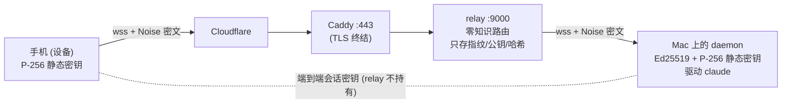

# cc-pocket 安全与信任模型

cc-pocket 让你的手机在任意网络下驱动你电脑上的 `claude`，流量经一台公网中转服务器（relay）转发。本文说明：中转服务器**看不到你的对话内容**（零知识），它如何防攻击，以及你如何亲自验证这一点。

> 适用范围：当前部署 `wss://pocket.ark-nexus.cc`（中转）。relay 完全开源、可自托管（见文末）。

## 一句话信任模型

> daemon（你的电脑）与设备（你的手机）之间是**端到端加密**的；relay 只转发密文、按账户路由，**进程内存里也读不到** prompt、代码或任何会话密钥。即使运营 relay 的人也不是特权窃听者。



## 身份与配对（无登录、无 PII）

- **租户 = daemon 自生成的 Ed25519 静态密钥**。account id = 该公钥的指纹（`base32(sha256(pubkey))`）。「注册」=跑起 daemon，没有邮箱 / 密码 / 后台账号。
- **设备 = 手机自生成的 P-256 静态密钥**，存在设备本地。
- **配对**把设备绑定到某个 daemon，密钥经二维码**带外**交换：
  1. daemon（已鉴权）向 relay 申请一张一次性**配对票据**，在可信的 Mac 屏幕上显示二维码 `ccpocket://pair?relay&acct&dpk&ticket`（`dpk` = daemon 的 P-256 公钥）。
  2. 手机扫码 / 粘贴 → 拿到 daemon 公钥（带外、可信）→ 用票据兑换：注册自己的公钥、领取设备凭据。
  3. relay 把设备公钥转发给 daemon 作为**提示**；daemon 仅在首次握手用票据 PSK 校验通过后才钉入允许列表。

因为 daemon 公钥经二维码（可信屏幕）到手机、设备公钥的真实性由**只有两端知道的票据 PSK** 兜底，**relay 无法中间人替换任一方密钥**。

## 加密套件

端到端通道在 `protocol` 模块（`e2e/`），daemon 与手机共用同一份多平台实现（cryptography-kotlin：JVM 用 JDK，iOS 用 CryptoKit）。

| 环节 | 算法 |
| --- | --- |
| 密钥协商 | **P-256 ECDH**（4 次 DH：`es ‖ ss ‖ ee ‖ se`，X3DH / Noise-KK 风格） |
| 密钥派生 | **HKDF-SHA256**（salt = 握手转录，绑定双方静态+临时公钥） |
| 报文加密 | **AES-256-GCM**，每方向独立密钥，64-bit 递增计数器做 nonce（拒绝重放/乱序） |
| daemon→relay 鉴权 | **Ed25519** 签名挑战 |

- **互相认证**：`ss`（静态×静态）+ `se`/`es`（静态×临时）双向绑定两端身份。
- **前向保密**：每会话新临时密钥；静态私钥日后泄露也无法解历史会话。
- **首次配对**：把票据当 Noise PSK 混入 HKDF，relay 若替换转发的设备公钥则握手失败、daemon 不钉入。

> 为什么是 P-256 而非 X25519：本项目 Kotlin 2.1.21，能消费的 cryptography-kotlin 版本只暴露 P-256；握手构造与曲线无关，P-256 + AES-GCM 是 iOS/Android/JVM 都原生支持的标准强套件。

## relay 存什么 / 看什么（威胁对照）

**持久化（SQLite，只存哈希、公钥、指纹——绝无内容、绝无私钥）：** account id、daemon Ed25519 公钥、设备 P-256 公钥（不透明 blob）、`sha256(凭据)`、`sha256(票据)`、时间戳、`revoked`。

**日志：** 仅连接生命周期、鉴权成败码、限流、字节计数——**绝不记录帧内容**。

| 攻击 | 缓解 |
| --- | --- |
| daemon 冒充 | Ed25519 签名挑战；account id == 公钥指纹；TOFU 钉公钥；nonce 单用 30s、绑 socket、入签名转录 |
| 设备劫持 | 高熵 `deviceId.secret`，库里只存 `sha256(secret)` 常量时间比对；可吊销 + 强制断连 |
| 配对码爆破 | 256-bit 单用票据、TTL 120s、原子认领；只有已鉴权 daemon 能 mint；redeem 限流+退避锁定 |
| 密钥交换 MITM | relay 两边静态密钥都不提供；daemon 公钥走二维码、设备公钥由票据 PSK 兜底 |
| 重放 | 服务器 nonce 单用；GCM 计数器严格递增 |
| DoS / 资源耗尽 | 每 IP/每 account 限流锁定；连接/设备数上限；4 MiB 帧上限（`RelayServer.MAX_FRAME`）；ping/timeout；有界缓冲 |
| **运营者偷看** | 二进制数据面绝不解码；只过 Noise 密文；库里只有哈希/公钥；日志只有元数据 |

**接受的残余元数据泄露（v1 不混淆，明示）：** account↔device 路由图、在线时序、密文大小/时序、源 IP。

## 自证零知识

抓一帧数据面看是密文（本机即可，无需公网）：

```bash
JAVA_HOME=/opt/homebrew/opt/openjdk@17 bash scripts/relay-smoke.sh        # 本地 relay
JAVA_HOME=/opt/homebrew/opt/openjdk@17 bash scripts/relay-smoke-prod.sh   # 经 Cloudflare 的线上 relay
```

单元测试也确定性地证明了「relay 只见密文 / 换密钥即失败」：

```bash
./gradlew :protocol:jvmTest --tests "dev.ccpocket.protocol.e2e.*"
# relay_sees_only_ciphertext / mismatched_psk_breaks_the_channel / wrong_peer_static_breaks_the_channel
```

## 自托管 relay

relay 无任何密钥托管，搬到你自己的机器即可（一条 systemd + 一段 Caddyfile，见 `deploy/`）：

```bash
./gradlew :relay:installDist      # 产物 relay/build/install/cc-pocket-relay
# 拷到服务器，systemd 跑 `cc-pocket-relay --host 127.0.0.1 --port 9000 --db <path>`，Caddy 反代 + 自动 TLS
```

daemon 改用你的域名：`cc-pocket-daemon run --relay wss://<你的域名>`。

## 已知限制 / 后续硬化

- **设备私钥存储**：移动端 v1 用 NSUserDefaults / SharedPreferences（应用私有但非硬件级）。生产应迁到 iOS Keychain / Android Keystore（接口 `SecureStore` 已就位，换实现即可）。
- **配对录入**：支持相机扫码（App 内置 qrkit 扫码器）、手输 6 位码、粘贴 `ccpocket://` 链接，以及局域网直连 URL（高级选项）。
- **票据↔设备 PSK 匹配**：daemon 用「最近 mint 的票据」启发式关联刚配对的设备（交互式串行配对下正确）。
- **未经独立审计**：Noise 风格通道为本项目自实现（基于 cryptography-kotlin 原语）。欢迎审计。
- **客户端遥测**：App 接入 Firebase（Analytics/Crashlytics），仅上报枚举级事件元数据（如 AppLaunch / Paired / Connected）与崩溃信息，**不含 prompt、代码或会话内容**；它直连 Google、**不经 relay**，与「relay 零知识」是两回事（源码 `telemetry/` 可关闭或替换）。
- **元数据**：见上「残余泄露」。

## 报告漏洞（Reporting a Vulnerability）

**首选渠道：GitHub 私密漏洞报告** —— [Security → Report a vulnerability](https://github.com/ac54u-mobile/cc-pocket/security/advisories/new)，内容仅维护者可见。请不要在公开 issue 中披露未修复的漏洞。

- **响应**：尽力 72 小时内确认收到；确认属实后给出修复计划，修复发布后公开致谢（可要求匿名）。
- **支持版本**：只修复**最新 release**——daemon 自带自更新、App 走商店更新，请先升级到最新版再复现。
- **重点审计面**：端到端通道（`protocol/e2e`）、relay 鉴权 / 配对 / 限流、daemon 权限桥（见上文威胁对照表）。

*English:* please report vulnerabilities privately via GitHub's [private vulnerability reporting](https://github.com/ac54u-mobile/cc-pocket/security/advisories/new) instead of a public issue. Best-effort acknowledgement within 72 hours; fixes target the latest release only.
