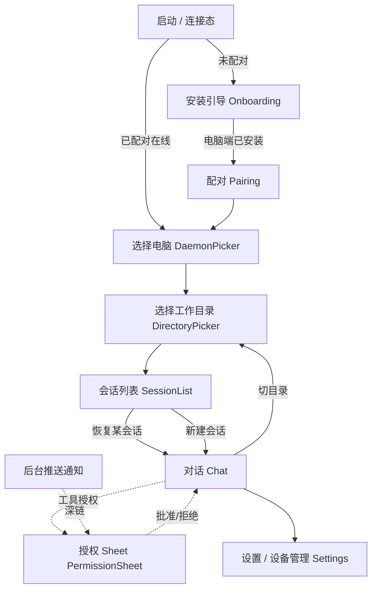

# cc-pocket 移动端界面设计文档（UI/UX Design Spec）

> 用途：这是一份提供给 **AI 设计工具**（Stitch、v0、Figma Make 等）的设计输入。前半部分是面向人的产品/系统约束，**第 10 章是可直接粘贴的中文生成提示词**。
> 关键可调项已用 ⚙️ 标注——视觉风格、配色基调这类主观选择，你可以一句话让我改，结构性内容（屏/组件/状态）与风格无关、不受影响。

---

## 1. 产品定位与设计原则

**一句话**：在手机上操控电脑上的 Claude Code——恢复电脑上已有会话、新建会话、灵活切目录、随时批准/拒绝 Claude 的工具授权。

**用户画像**：开发者本人。主力在电脑的终端/IDE 里写代码，手机是「第二块屏 + 遥控器」：人离开电脑时，用手机接管正在跑的 Claude 会话。

**典型场景**：
- 离开工位，手机上批准一个卡住的工具授权弹窗（最高频、最关键）。
- 通勤路上看 Claude 流式输出、追问一句。
- 临时新建一个会话，让 Claude 在某个仓库里跑点东西。
- 会话中途把工作目录切到另一个仓库。

**设计原则**：
1. **一屏一事，路径笔直**：配对 → 选电脑 → 选目录 → 选/建会话 → 对话。每步只做一个决定。
2. **流式优先**：对话区像 IM 一样实时滚动，首字节尽快出现，光标在动 = 系统在工作。
3. **授权是一等公民**：弹窗醒目、可秒批可秒拒、带倒计时、**超时默认拒绝**（安全优先）。
4. **开发者信息密度**：路径、分支、sessionId、token 用等宽字体，信息可快速扫读，不为了「好看」牺牲可辨识。
5. **始终有安全感**：任何时候都能一眼看到「连的哪台电脑 · 哪个目录 · 哪种权限模式」。

---

## 2. 视觉语言（Design System）

> ⚙️ **可调项——默认基调**：暗色优先 + 完整浅色（跟随系统）；强调色取**暖陶土 / 赤陶色**（与 Claude 品牌气质相邻，但本项目是独立 MIT 工具，不强绑），克制使用。备选方向见第 11 章。

### 2.1 配色 Token

暗色为主题默认；浅色为系统切换备选。语义色两套通用。

| Token | Dark（默认） | Light | 用途 |
|---|---|---|---|
| `bg/base` | `#0E0F11` | `#FAF9F7` | 根背景（暖调近黑 / 暖奶白） |
| `surface` | `#16181B` | `#FFFFFF` | 卡片、列表行、输入栏 |
| `surface/raised` | `#1E2125` | `#F4F2EE` | 浮层、sheet、被选中行 |
| `border/hairline` | `#2A2E33` | `#E7E4DF` | 分隔线、卡片描边（暗色靠描边而非重阴影） |
| `text/primary` | `#ECEDEE` | `#1A1A19` | 正文、标题 |
| `text/secondary` | `#9BA1A6` | `#5C5A55` | 次要信息、元数据 |
| `text/muted` | `#6B7177` | `#8A8780` | 占位符、禁用、时间戳 |
| `accent` | `#D97757` | `#C75A38` | 主操作、激活态、流式光标、强调（陶土色） |
| `accent/pressed` | `#C4633F` | `#A94A2C` | 主操作按下 |
| `accent/subtle` | `#2A1E18` | `#F6E7DF` | 强调色浅底（标签、active 行背景） |
| `success` | `#4FB477` | `#2F9E63` | Allow、连接正常、完成 |
| `warning` | `#E0A93B` | `#B5841F` | bypass/危险权限模式提示、超时临近 |
| `danger` | `#E5604D` | `#CC4434` | Deny、错误、吊销设备 |
| `info` | `#5B9BD5` | `#3B7CC2` | 中性提示、链接 |

### 2.2 字体

- **UI 无衬线**：iOS = SF Pro Text，Android = Roboto（系统默认，不内嵌）。
- **等宽**：SF Mono / JetBrains Mono / Roboto Mono——**专用于**路径、sessionId、git 分支、代码块、token 数、目录名。这是开发者工具气质的关键。

| 角色 | 字号 / 行高 | 字重 | 字体 |
|---|---|---|---|
| Display（配对码、空态大标题） | 28 / 34 | Semibold | UI |
| Title（页面标题） | 22 / 28 | Semibold | UI |
| Headline（卡片标题、会话标题） | 17 / 22 | Semibold | UI |
| Body（对话正文） | 15 / 22 | Regular | UI |
| Callout（按钮、标签） | 14 / 18 | Medium | UI |
| Caption（元数据、时间） | 12 / 16 | Regular | UI |
| Mono（路径 / id / 代码 / token） | 13 / 20 | Regular | Mono |

### 2.3 间距 / 圆角 / 高度

- **间距**：4pt 基准 → `4 · 8 · 12 · 16 · 20 · 24 · 32`。页面水平边距 16，卡片内边距 16，列表行垂直 12–14。
- **圆角**：`sm 8`（标签 / 小按钮）、`md 12`（卡片 / 输入栏 / 气泡）、`lg 16`（大卡片）、`sheet 20`（底部 sheet 顶角）、`pill 999`（状态条 / 模式徽标 / 滚到底按钮）。
- **高度 / 阴影**：暗色**优先用描边 + 表面提亮**表达层级，阴影极弱；浅色用柔和阴影（y2 blur8 8% / sheet y-4 blur24 12%）。
- **触达区**：所有可点元素 ≥ 44×44pt。

### 2.4 动效

- **流式**：助手气泡内逐 chunk 淡入，**末尾闪烁陶土色光标**表示生成中；用户上滑离底时显示「↓ 滚到底」pill。
- **Sheet**：从底部弹簧上滑，scrim 渐入；权限 sheet 到达时**轻触觉反馈 + 一次微脉冲**。
- **列表**：会话/目录加载用骨架屏 shimmer；进入轻微 8pt 上移淡入。
- **连接态**：顶部连接条在「重连中」时强调色细线左右流动。

### 2.5 图标

线性图标，统一 1.5pt 描边，圆角端点。关键图标：电脑/daemon、文件夹、分支、新建（＋）、发送、停止（■）、盾牌（权限）、勾（allow）、叉（deny）、闪电（auto 模式）、齿轮（设置）。

---

## 3. 信息架构与导航



- **安装引导 → 配对**是一次性 onboarding：先指导用户在电脑端安装并运行 daemon，再扫码或输入六位码；完成后默认直达「会话列表」（记住上次的电脑+目录）。
- **主轴**是会话栈：列表 → 对话；对话内可下钻切目录、上浮权限 sheet。
- **三种连接状态**贯穿全局，由顶部连接条表达：`未配对` / `已配对·daemon 离线` / `在线`。

---

## 4. 屏幕清单（Screen Inventory）

| # | 屏 | 一句话 | 里程碑 |
|---|---|---|---|
| 1 | Splash / 连接态 | 启动时判断配对与在线状态，路由到对应入口 | M2 |
| 2 | Pairing 配对 | 扫码或输入 6 位配对码，把手机绑定到电脑 daemon | M1/M2 |
| 3 | DaemonPicker 选电脑 | 多台电脑时选择要操控的那台（在线/离线状态） | M2 |
| 4 | DirectoryPicker 选目录 | recents 置顶 + 浏览，挑工作目录，有历史会话的目录带徽标 | M2 |
| 5 | SessionList 会话列表 | 列出可恢复会话（标题/消息数/分支/时间）+ 醒目「新建会话」 | M2 |
| 6 | Chat 对话 | 流式 markdown、代码块、工具事件、输入栏、权限模式标识、切目录 | M2 |
| 7 | PermissionSheet 授权 | 底部 sheet：工具名+输入预览+Allow/Deny+倒计时 | M2 |
| 8 | SwitchDirectory 切目录 | 在对话内触发，确认后用新 cwd 重启会话 | M2 |
| 9 | Settings / 设备管理 | 默认权限模式、已配对设备/吊销、关于、主题 | M2/M3 |
| 10 | 后台授权通知 | App 退后台时收推送，点通知深链到授权 sheet | M4 |

---

## 5. 逐屏规格

> 每屏给出：**目的 · 布局 · 组件 · 状态 · 交互 · 边界**。布局描述按从上到下的视觉顺序，方便 AI 工具还原。

### 5.1 Pairing 配对

- **目的**：把手机和电脑上的 daemon 绑定。电脑终端会显示一个二维码 + 6 位短码（≤120s、单次）。
- **布局**（上→下）：标题「连接你的电脑」+ 副标题说明；**大号扫码取景框**（主操作）；下方「或输入配对码」分隔；**6 位分隔输入框**（等宽、每位一格）；底部「在电脑终端运行 `cc-pocket pair` 获取配对码」提示 + 帮助链接。
- **组件**：相机取景框（带四角描边动画）、6 段 OTP 输入、主按钮「连接」、文字帮助。
- **状态**：默认 / 相机无权限（降级为只输码 + 引导开权限）/ 校验中（按钮 loading）/ 码错误或过期（输入框 danger 抖动 + 重试）/ 成功（勾动画 → 进列表）。
- **交互**：扫码识别后自动校验；输码满 6 位自动提交。
- **边界**：码过期要清晰提示「重新在电脑获取」；同账号多设备允许。

### 5.2 DaemonPicker 选择电脑

- **目的**：一个账号下多台电脑时选一台。**单台时此屏跳过**，直接进目录。
- **布局**：标题「选择电脑」；电脑卡片列表，每卡：主机名（如 `Lidapeng-MacBook`）、OS 图标、在线状态点（绿/灰）、最后活跃时间（等宽）、当前/上次目录预览。
- **状态**：全部离线（引导「确认电脑上 daemon 在运行」）/ 加载骨架 / 仅一台（自动跳过）。
- **交互**：点在线电脑进入；离线电脑置灰但可点查看「如何唤醒」。

### 5.3 DirectoryPicker 选择工作目录

- **目的**：选 Claude 要在哪个目录里跑（= 子进程 cwd）。
- **布局**（上→下）：顶部连接条（电脑名）；**「最近 Recents」分组**（置顶，最多 5 条）；分隔；**「浏览 Browse」**——当前路径面包屑（等宽、可点逐级回退）+ 子目录列表。每个目录行：文件夹图标 + 目录名（等宽）+（若有历史会话）**陶土色「N 个会话」徽标** + 右侧 chevron。
- **组件**：连接条、recents 行、面包屑、目录行 + hasSessions 徽标、搜索框（可选）。
- **状态**：加载骨架 / 空目录 / 无权限目录（置灰 + 锁图标）/ 无 recents（只显示浏览）。
- **交互**：点目录行下钻；点 recents 直达该目录的会话列表；点「选择此目录」确认。
- **边界**：路径很长 → 面包屑中段省略；符号链接/不可读目录要安全降级。

### 5.4 SessionList 会话列表

- **目的**：本目录下可恢复的会话 + 新建入口。**列会话不拉起 claude**（读磁盘 .jsonl）。
- **布局**（上→下）：顶部连接条（电脑 · 目录 · 当前分支）；**置顶「＋ 新建会话」大行/按钮**（陶土色，最醒目）；会话卡片列表，按最近修改倒序。每张会话卡：
  - **标题**（Headline，取 AI 生成标题，无则取首条 prompt 截断）；
  - 首条 prompt 预览一行（secondary）；
  - 底部元数据行（等宽 caption）：`💬 N 条` · `⑂ 分支名` · `相对时间`。
- **组件**：连接条、新建会话行、会话卡、空态插画。
- **状态**：加载骨架（3–4 张占位卡）/ 空（无会话 → 只剩醒目「新建会话」+ 引导文案）/ 错误（读盘失败 → 重试）。
- **交互**：点会话卡 → 恢复进对话；点「新建会话」→ 选权限模式（可选）→ 进对话；长按会话卡 → 操作（删除/重命名标题——后续）。
- **边界**：消息数要排除工具结果回合（只数真实用户轮）；标题为空兜底。

### 5.5 Chat 对话（核心屏）

- **目的**：发指令、看流式输出、处理授权、管理本轮。
- **布局**（上→下）：
  1. **顶部连接条**（可点展开）：返回 + 会话标题 + 右侧**权限模式徽标**（如 `default` 灰 / `auto` ⚡ 陶土 / `bypass` ⚠️ amber）+ 溢出菜单（切目录、设置、关闭会话）。
  2. **消息流**（可滚动主体）：
     - **用户气泡**：右对齐 / 或顶格带「你」标签（⚙️ 二选一，默认顶格，开发者工具偏文档流而非 IM 双气泡）。
     - **助手输出**：左对齐 markdown——段落、列表、**代码块**（深色底、语言标签、右上复制按钮、等宽、横向滚动）、行内 code。生成中末尾**闪烁陶土光标**。
     - **思考块 thinking**：默认折叠的「💭 思考」条，点开看推理（次要色、等宽可选）。
     - **工具事件条 tool_use**：一行卡片——工具图标 + 工具名（如 `Bash` / `Write`）+ 输入预览（等宽截断）+ 右侧状态（运行中转圈 / ✓ 成功 / ✗ 失败）。点开看完整输入/结果。
     - **回合结束**：极轻的分隔 + token 用量 caption（`↑1.2k ↓340`，等宽）。
  3. **滚动辅助**：上滑离底时浮现「↓ 滚到底」pill。
  4. **输入栏**（贴底，安全区内）：多行自适应输入框 + 左「＋」（附件，占位/后续）+ 右**发送/停止**按钮（生成中变 ■ 停止）。
- **组件**：连接条、权限模式徽标、用户气泡、助手 markdown 渲染器、代码块、思考折叠块、工具事件条、token 用量条、滚到底 pill、输入栏。
- **状态**：空会话（引导「发第一条消息」）/ 生成中（光标+停止键）/ 等待授权（消息流内嵌「⏸ 等待你授权」+ 同时弹 sheet）/ daemon 掉线（顶部 danger 条「连接断开·重连中」，输入禁用）/ 错误结果（红色系统条）。
- **交互**：发送 → 乐观显示用户消息 + 助手骨架；停止 → 中断本轮；下拉无；长按消息复制；点代码块复制。
- **边界**：超长输出虚拟列表性能；流中途断网要保留已收内容并标注「连接中断」；快速连发要排队提示。

### 5.6 PermissionSheet 授权弹窗（关键安全交互）

- **目的**：Claude 请求用某个工具时，让用户**秒级决策**。
- **形态**：对话内为**底部 sheet**；从后台推送进入为**全屏专注页**（同内容放大）。
- **布局**（上→下）：抓手条；**盾牌图标 + 「Claude 请求授权」**；**工具名大字**（如 `执行命令 Bash` / `写文件 Write`）；**输入预览卡**（等宽、深底，命令/路径/diff 摘要，可展开看全文）；目标目录 + 分支小字（等宽，强化「在哪台电脑哪个目录」的安全感）；**倒计时环**（默认 30s，临近转 amber/danger）；底部**双按钮**：`拒绝`（danger 描边，左）/ `允许`（success/accent 实心，右，主操作）。可选「本会话内记住此工具」勾选。
- **组件**：盾牌头、工具名、输入预览（可展开 + 复制）、目录/分支条、倒计时环、Allow/Deny 双按钮。
- **状态**：默认待决 / 展开看全文 / 倒计时临近（环变色 + 轻提示）/ **超时（自动拒绝，sheet 关闭并在流里标注「已超时拒绝」）** / 已被对端取消（Claude 撤回请求 → sheet 自动消失，提示「请求已取消」）。
- **交互**：Allow/Deny 即时回传；支持 Deny 附理由（可选输入）；危险工具（如 `Bash rm` / `bypass` 模式）视觉升级为 warning/danger 基调。
- **边界**：**超时永远默认拒绝**；`auto` 模式下本屏不出现（daemon 本地放行）；多请求排队时一次只显示一个，余下计数提示。

### 5.7 SwitchDirectory 切目录

- **目的**：会话进行中换工作目录（= 用新 cwd 重启子进程）。
- **形态**：对话溢出菜单触发 → 小型确认 sheet（内嵌一个精简 DirectoryPicker）。
- **布局**：标题「切换工作目录」；当前目录（等宽，置灰）；目标目录选择（recents + 浏览）；说明文案「⚙️ 默认：在新目录开一个全新会话」（见第 11 章 R8 决策）；底部「切换」按钮。
- **状态**：选择中 / 切换中（重启子进程 loading）/ 失败（目录无效）。
- **边界**：明确告知会话历史的处理方式（全新 or 续接），避免用户误以为上下文延续。

### 5.8 Settings / 设备管理

- **布局**：分组列表——「默认权限模式」（6 选项，bypass 带 ⚠️ 二次确认）；「已配对设备」（本机 + 其他，每行可**吊销**，danger）；「外观」（跟随系统/暗/亮）；「关于」（版本、开源协议 MIT、daemon 连接信息）。
- **边界**：吊销当前设备需强确认；展示 daemon 版本/地址便于排查。

### 5.9 后台授权通知（M4）

- **通知内容**：极简、**不含 prompt 内容**（隐私）——「Claude 需要授权 · <目录名>」+ Allow/Deny 快捷操作（iOS 可交互通知 / Android action）。
- **深链**：点通知 → 直接打开全屏 PermissionSheet（5.6）。
- **边界**：通知里直接 Allow/Deny 也要走同一超时与取消逻辑。

---

## 6. 核心组件库（Component Library）

供 AI 工具复用的原子/分子组件：

1. **连接条 ConnectionBar**：电脑名 · 目录（等宽截断）· 权限模式徽标 · 在线点。三态（在线/重连/离线）。
2. **会话卡 SessionCard**：标题 + prompt 预览 + 元数据行（消息数/分支/时间，等宽）。
3. **目录行 DirectoryRow**：文件夹图标 + 名（等宽）+ hasSessions 徽标 + chevron。
4. **用户消息 / 助手消息**：见 5.5。
5. **代码块 CodeBlock**：语言标签 + 复制 + 等宽 + 横向滚动 + 深底。
6. **思考折叠块 ThinkingBlock**：默认收起，次要色。
7. **工具事件条 ToolEventRow**：图标 + 名 + 输入预览 + 状态（运行/成功/失败）。
8. **权限卡 PermissionCard**：盾牌 + 工具名 + 输入预览 + 倒计时环 + Allow/Deny。
9. **输入栏 Composer**：多行 + 发送/停止 + 附件占位。
10. **权限模式徽标 ModeBadge**：`default/acceptEdits/auto/plan/dontAsk/bypass` 各自配色与图标。
11. **OTP 输入 / 二维码取景框**：配对用。
12. **状态占位**：空态 / 错误态 / 离线条 / 骨架屏 shimmer。
13. **滚到底 pill · token 用量条 · 倒计时环**：小工具件。

---

## 7. 状态与边界（全局）

| 场景 | 表现 |
|---|---|
| daemon 离线 | 顶部 danger 连接条「连接断开 · 重连中」，输入禁用，列表只读缓存 |
| 网络切换（WiFi↔蜂窝） | 静默重连，期间显示重连细线，不丢已收消息 |
| 权限超时 | **自动拒绝**，流内标注「已超时拒绝」 |
| 权限被对端取消 | sheet 自动消失 + toast「请求已取消」 |
| claude 未找到 / 启动失败 | 系统错误卡 + 「检查电脑上 claude 安装」引导 |
| 目录无权限 / 无效 | 目录行置灰锁图标；切目录失败明确报错 |
| 空：无会话 / 无目录 / 无设备 | 各自空态插画 + 单一主行动 |
| 超长输出 | 虚拟列表 + 代码块横向滚动，性能不卡 |
| bypass 权限模式 | 全局 amber 提示气质，开启需二次确认 |

---

## 8. 无障碍与国际化

- **双语**：中文 + English（团队双语）。所有文案走 i18n；等宽内容（路径/命令）不翻译。
- **动态字体**：支持系统字号缩放，布局不破。
- **对比度**：正文文本对背景 ≥ 4.5:1；陶土强调色在暗底校验可读。
- **触达**：≥44pt；权限 Allow/Deny 间留足误触间距。
- **读屏**：VoiceOver/TalkBack 给权限卡完整朗读（工具名 + 输入摘要 + 倒计时）；流式输出用 live region 适度播报。

---

## 9. 平台差异（iOS / Android，Compose Multiplatform 共用一套）

| 维度 | iOS | Android |
|---|---|---|
| 返回 | 左缘滑动返回手势 | 系统返回键/手势 |
| Sheet | 原生卡片式 sheet 质感、抓手条 | Material 3 bottom sheet |
| 通知 | APNs，可交互通知含 Allow/Deny | FCM，notification actions |
| 凭证存储 | Keychain | EncryptedSharedPrefs |
| 安全区 | 刘海/Home 指示条留白 | 状态栏/手势条留白 |
| 字体 | SF Pro / SF Mono | Roboto / Roboto Mono |

> 逻辑层全在 `commonMain`，平台差异只在导航返回、通知、凭证、安全区这几处薄壳。视觉风格保持一致，不为单平台定制两套外观。

---

## 10. 给 AI 设计工具的 Brief（可直接粘贴）

> 用法：先粘贴「设计系统摘要」设定全局风格，再按优先级逐屏粘贴提示词生成。仓库文档统一使用中文。

### 10.1 设计系统摘要（先喂这段）

```
设计一款名为 CC Pocket 的开发者远程控制移动应用，用于操控电脑上的 Claude Code、Codex 与 Cursor Agent。整体安静、专注、开发者原生，像精心制作的终端或 IDE 伴侣，不要做成活泼的消费应用。

以深色为主并提供浅色变体。深色使用 #0E0F11、#16181B、#1E2125 和 #2A2E33 分层；赤陶色 #D97757 只用于主操作、活动状态和流式光标。成功、警告、危险、信息分别使用 #4FB477、#E0A93B、#E5604D、#5B9BD5。

普通界面使用系统无衬线字体；路径、会话 ID、Git 分支、代码和 Token 使用等宽字体。遵循 4pt 网格、16pt 屏幕边距、细边框层级和至少 44pt 的点击区域。
```

### 10.2 逐屏 Prompt（按生成优先级）

**① Chat（最高优先，最能定调）**
```
聊天页：顶部是返回、会话标题、状态和低频菜单；正文是可滚动消息流，支持 Markdown、代码块、思考折叠、工具事件、流式光标和 Token 信息。用户消息与 Agent 回复要有清楚层级。底部输入区支持多行文本、附件和发送/停止，并遵守安全区。模型、思考强度、执行模式和上下文用量放在输入框上方。
```

**② PermissionSheet（关键安全屏）**
```
权限请求底部弹层：依次显示抓手、盾牌图标、权限说明、工具名称、可展开命令预览、目标目录和 Git 分支、倒计时、本会话记住选项，以及拒绝/允许按钮。危险操作必须醒目，信息应在两秒内读懂。
```

**③ SessionList（会话列表）**
```
会话列表：顶部显示电脑、目录和当前 Git 分支；突出“新建会话”入口。会话按最新优先排列，每项包含标题、首条请求摘要、消息数、分支和相对时间，并设计骨架加载、空状态和归档状态。
```

**④ DirectoryPicker（选目录）**
```
目录选择：顶部显示电脑名称；先展示最近目录，再用可点击面包屑和子目录列表浏览。每行包含文件夹、等宽目录名、可选会话数和箭头，底部提供“使用此目录”，并包含加载状态。
```

**⑤ Pairing（配对）**
```
配对页：显示连接说明、二维码相机取景框、6 位配对码输入和连接按钮。提示用户在电脑执行 `cc-pocket-daemon pair`。过期或错误时让输入框以危险色轻微抖动，并给出可恢复说明。
```

**⑥ DaemonPicker（选电脑，多机时）**
```
电脑选择：以卡片展示主机名、系统图标、在线/离线状态、最近活动时间和当前或最近工作目录；离线卡片弱化显示。
```

**⑦ Settings / 设备管理**
```
设置页：使用分组列表展示默认 Agent、默认执行模式、默认思考强度、Token 用量、已配对设备和关于信息。高风险模式带警告；外观始终跟随手机系统，不提供独立外观选项。
```

### 10.3 生成顺序建议

1. **Chat** → 锁定整体气质与 markdown/代码/工具事件的样子。
2. **PermissionSheet** → 验证关键安全交互的清晰度。
3. **SessionList → DirectoryPicker** → 列表与浏览体系。
4. **Pairing → DaemonPicker → Settings** → onboarding 与边角。
5. 各屏要 **dark + light 两版** 与关键 **空/加载/错误/离线** 态变体。

---

## 11. ⚙️ 关键可调项（一句话就能让我改）

| 项 | 当前默认 | 备选 |
|---|---|---|
| 整体气质 | 暗色开发者终端风 + 陶土强调色 | A) 现代 AI 产品风（渐变/玻璃/更鲜亮）；B) 浅色清爽消费风（圆角卡片/蓝靛/亲和） |
| 用户消息样式 | 顶格 + 「你」标签（文档流） | IM 式右对齐双气泡 |
| 强调色 | 陶土 `#D97757`（Claude 相邻） | 任意品牌色（蓝/绿/紫……） |
| 切目录会话语义（R8） | 新目录开**全新会话**（最稳） | 用 `--resume` 续接同一会话（依赖 claude 版本，需 M0 验证） |
| 目标设计工具 | **claude.ai/design**（已采用，handoff 落到 `claude-design-handoff/`） | §10 的 prompt 工具无关，可另喂 v0 / Figma Make 等 |

---

## 12. 落地（本文档之后）

- **本文档** `cc-pocket/docs/design/UI-DESIGN.md` 是正式设计输入与规格。
- **已采用 claude.ai/design**：用 §10 的 brief 在 claude.ai/design 生成 7 屏，经 Handoff to Code 导出到 [`claude-design-handoff/`](./claude-design-handoff/)（各屏 `.html/.jsx` + 设计对话）——这是项目唯一保留的设计版本，后续 Compose 实现以它为像素级参照。
- **历史选型对比**（Stitch ⟷ Claude Design）已归档到 Obsidian `~/Desktop/Brain/20_Projects/cc-pocket-设计工具评估/`，项目内不再保留 Stitch 产物。
- **与实现的关系**：这份只管界面；daemon↔claude 技术实现（M0）单独走，互不阻塞。
```
