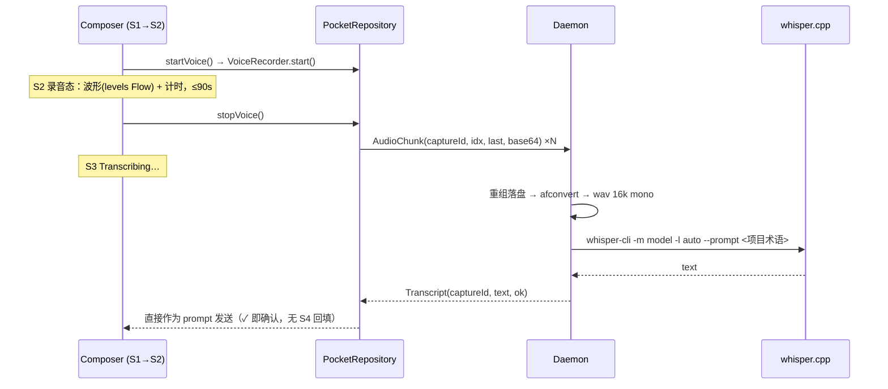

# cc-pocket 语音输入技术方案（Voice Input Design）

> 配套 UI 规格：见 Outbox 设计提示词（听写转文字，Composer 六状态 S1–S6）；本文档定**客户端 + daemon 的实现架构**。
> 交互前提（2026-06-10 用户定稿）：点麦克风录音 → ✓ 确认 → 转写完成**直接作为 prompt 发送**，不落输入框二次确认；要修改就 ✕ 取消改手打。原「永不自动发送」原则由「✓ 即人工确认」承担。

---

## 1. 核心决策：转写引擎放在哪

| 方案 | 思路 | 优点 | 致命问题 |
|---|---|---|---|
| A. 端侧原生 | iOS `SFSpeechRecognizer`、Android `SpeechRecognizer` | 实时 partial、零成本、离线可用 | Android 依赖 ROM 的识别服务——**国产无 GMS 机型大面积不可用**；Desktop（JVM）无原生；三端三套实现 |
| B. 云端 STT API | Whisper API / Groq / 讯飞 | 质量统一、实现薄 | 要 API key 和计费体系；国内网络需代理；语音出用户设备（隐私）|
| C. **daemon 转写（推荐）** | 手机只录音，音频经既有 E2E 通道发给 Mac 上的 daemon，daemon 跑 whisper.cpp | 见下 | 无实时 partial（录完再转）；daemon 需装 whisper + 模型 |

**推荐 C 为主干，理由扎根产品形态：**

1. **用户画像即「必有一台跑 daemon 的 Mac」**——这是 cc-pocket 的准入前提。Apple Silicon 上 whisper.cpp（base/small 模型）转写速度数倍于实时，30 秒语音约 1–3 秒出结果，正好落在 UI 的 S3「Transcribing…」状态里。
2. **三端一条路径**：Android（含国产 ROM）、iOS、Desktop 客户端只做「录音 + 发帧」，转写逻辑零平台差异；这与项目「逻辑全在 commonMain，平台只留薄壳」的既有原则一致。
3. **离线不损失场景**：daemon 断连时本来就发不了 prompt，「连上才能语音」没有额外牺牲。
4. **中英混说友好**：开发者口述里夹杂代码术语，whisper 多语种 + `--prompt` 词表注入表现好；而且 **daemon 知道 workdir**——可以把 git 分支名、顶层文件名、近期会话术语拼进 initial prompt，定向提升「ClaudeProcess」「relay」这类项目词的识别准确率。这是端侧/云端方案做不到的差异化能力。
5. **隐私**：音频走既有 Noise 端到端加密通道，relay 只见密文；语音不出用户自己的设备圈。

**P0 实施定稿：双引擎**（用户拍板）——iOS 走 `SFSpeechRecognizer` 原生实时听写（逐词上屏，S2 的 live transcript 完整呈现，文字不经 daemon）；Android / Desktop 走方案 C（录音 → daemon whisper）。引擎抽象为 `expect object NativeDictation { val available: Boolean; … }`，iOS 原生引擎报错后该设备的重试自动回落 daemon 路径（`preferRemote` 粘性）。Android 有识别服务的机型接原生听写留作后续增强。

---

## 2. 整体链路



取消（S2 左侧 ✕）：手机直接丢弃录音；若已开始上传则补发 `AudioCancel`，daemon 清理临时文件。

---

## 3. 协议层（protocol/Messages.kt 新增）

```kotlin
/** 手机到 daemon：一段录音分块；同次录音共用 captureId。 */
@Serializable @SerialName("pocket/audio.chunk")
data class AudioChunk(
    val convoId: String,
    val captureId: String,   // 手机生成的 UUID，每次录音一个
    val idx: Int,            // 从 0 开始，daemon 按顺序重组
    val last: Boolean,       // 最后一块为 true，随后开始转写
    val mediaType: String,   // "audio/mp4"（AAC m4a）或 "audio/wav"（桌面 PCM）
    val base64: String,
) : ToDaemon

/** 手机到 daemon：用户在上传途中取消录音。 */
@Serializable @SerialName("pocket/audio.cancel")
data class AudioCancel(val convoId: String, val captureId: String) : ToDaemon

/** daemon 到手机：转写结果；ok=false 时携带面向用户的错误。 */
@Serializable @SerialName("pocket/transcript")
data class Transcript(
    val convoId: String,
    val captureId: String,
    val text: String = "",
    val ok: Boolean = true,
    val error: String? = null, // 例如“未安装 whisper，请执行 brew install whisper-cpp”
) : ToPhone
```

**分块预算**：relay 帧上限 256 KiB（与图片同约束）。16 kHz 单声道 AAC ≈ 24 kbps ≈ 3 KB/s，base64 后 ≈ 4 KB/s → **单块 180 KB base64 可装约 45 秒**；90 秒录音上限 = 最多 2–3 块，无需流式协议。

---

## 4. 客户端（mobile/composeApp）

### 4.1 录音层：expect/actual `VoiceRecorder`

```kotlin
// commonMain — 与 SecureStore / ImageCompress 同模式
expect class VoiceRecorder {
    val levels: Flow<Float>            // 0..1 音量包络，驱动波形动画
    suspend fun start()                 // 抛 PermissionDenied → UI 走 S6 sheet
    suspend fun stop(): RecordedAudio   // bytes + mediaType + durationMs
    fun cancel()
}
```

| 平台 | 实现 | 备注 |
|---|---|---|
| Android | `MediaRecorder`（AAC / MPEG_4 / 16 kHz / mono / 24 kbps）+ `maxAmplitude` 轮询出 levels | `RECORD_AUDIO` 运行时权限 |
| iOS | `AVAudioRecorder`（kAudioFormatMPEG4AAC 同参数）+ metering | `NSMicrophoneUsageDescription`；`AVAudioSession` 设 record 类别 |
| Desktop | `javax.sound` TargetDataLine → 16 kHz PCM wav | 无压缩也够小（32 KB/s）；mediaType=audio/wav |

录音参数收口在 commonMain 常量（16 kHz / mono / 90 s 上限），与 whisper 输入要求对齐。

### 4.2 状态机（PocketRepository）

```kotlin
sealed interface VoiceState {
    object Idle : VoiceState
    data class Recording(val elapsedMs: Long) : VoiceState   // S2
    object Transcribing : VoiceState                          // S3（上传 + 等 Transcript 合并为一态）
    data class Failed(val message: String, val retryable: Boolean) : VoiceState // S5
}
```

- `startVoice()` / `stopVoice()` / `cancelVoice()`；stop 后切 Transcribing，分块发 `AudioChunk`，**保留原音频字节直到收到 ok**——失败态 S5 的「重试」直接重发，不用重录。
- 收 `Transcript(ok=true)`：**直接作为 prompt 发送**（`deliverTranscript`——「✓ 即确认并发送」，无 S4 回填编辑步）；文本为空则轻提示「没有识别到语音」回 Idle。
- 超时兜底：15 s 收不到 Transcript → Failed（与 mode-switch 的 8 s 兜底同模式）。
- 权限被拒：`start()` 抛 PermissionDenied → S6 引导 sheet（去系统设置），不进入 Recording。

### 4.3 Composer UI（App.kt）

- 输入框为空时显示麦克风键（线性 1.5pt，按下陶土色）；有文字时让位给 Send——与 UI 提示词 S1 一致。
- Recording 态：composer 行变形为录音条（✕ 取消 / 陶土波形（levels 驱动）/ 等宽计时 / ✓ 完成），高度包络不变。
- Transcribing 态：波形冻结 + spinner + 「Transcribing…」caption。
- 触觉反馈：录音起止各一次轻 tick（platform actual）。

---

## 5. daemon 转写服务（daemon/transcribe/）

### 5.1 `CaptureBuffer`

按 `captureId` 重组分块（乱序容忍：按 idx 排序，`last` 到齐才触发）；单会话同时只允许 1 个 capture，新 capture 顶掉旧的；60 s 没收齐自动丢弃。

### 5.2 `WhisperTranscriber`

```
m4a 临时文件 → afconvert -f WAVE -d LEI16@16000 -c 1 (macOS 自带，零依赖)
            → whisper-cli -m <model> -l auto --no-timestamps --prompt "<术语>" -f x.wav
            → 文本清洗（去首尾空白/重复幻觉行）→ Transcript
```

- **二进制发现**：PATH 中找 `whisper-cli`（`brew install whisper-cpp`）；找不到 → `Transcript(ok=false, error=安装引导)`，手机 S5 显示一行命令。Homebrew cask 的 README/Caveats 注明可选依赖。
- **模型**：默认 `small`（多语种，~466 MB，M 系列转写速度 ≫ 实时）；查找顺序 `~/.cache/cc-pocket/models/` → `~/.cache/whisper/`；缺失时首次用到自动下载（HuggingFace，支持镜像 env），下载期间回 `ok=false, error="模型下载中（xx%）…"`。
- **术语注入**：`--prompt` 把 workdir 名 + git 分支 + 仓库顶层文件/目录名裹进一句带全角标点的中文句子（≤200 字符，如“以下是 cc-pocket 项目的开发口述，可能提到 main、daemon 等术语。”）——daemon 已有这些信息，免费提升项目专有词准确率。**句式必须带标点**：whisper 会模仿 initial prompt 的文风，裸词表 prompt 会导致转写结果无标点（中文 + small 模型尤甚）。iOS 原生路径对应开 `addsPunctuation`（iOS 16+，部署目标 15 需运行时探测）。
- **超时**：转写进程 60 s 硬超时杀进程组（复用 ClaudeProcess 的进程组清理模式）。
- 临时文件用后即删；transcript 不写日志（隐私同 PermissionAsk 的处理基调）。

### 5.3 路由

`RequestRouter` 新增 `AudioChunk` / `AudioCancel` → `SessionRegistry` 找到 Conversation → 转写完用其 sink 回 `Transcript`。转写不占用 claude 进程，与正在流式输出的回合互不阻塞。

---

## 6. 边界与安全

| 场景 | 处理 |
|---|---|
| 录音中 daemon 掉线 | 照常录完，stop 时连接不在 → Failed（retryable，音频还在内存） |
| 转写为空（静音/噪声） | `ok=true, text=""` → 手机轻提示「没有识别到语音」，回 Idle |
| whisper 未安装 / 模型缺失 | `ok=false` + 引导文案，麦克风键不隐藏（装好即用） |
| 90 s 上限到 | 自动 stop 进入转写，等同点了 ✓ |
| App 切后台 | iOS/Android 录音中断 → cancel 并回 Idle（M1 不做后台续录） |
| 多设备同账号 | captureId 含 deviceId 前缀，Transcript 仅回发起 sink |
| 隐私 | 音频与文本全程走 Noise E2E；daemon 端临时文件即焚、不落日志 |

---

## 7. 里程碑

| 阶段 | 内容 | 验收 |
|---|---|---|
| **M1 daemon 侧** | 协议 3 帧 + CaptureBuffer + WhisperTranscriber + 单测（分块重组/超时/术语 prompt 拼装） | 用现成 m4a 文件经 TestClient 走通转写 |
| **M2 客户端** | VoiceRecorder 三端 actual + 状态机 + Composer 录音态 UI（按 claude.ai/design 出的稿落像素） | Android + iPhone 14 Pro Max 真机经 relay 全链路 |
| **M3 打磨** | S5/S6 边界、触觉、双语文案、模型自动下载体验 | 边界用例清单过一遍 |
| **已落地** | iOS SFSpeechRecognizer 原生实时听写（§1 定稿的双引擎之一），不可用回落 daemon | 实时 partial 上屏 ✓ |
